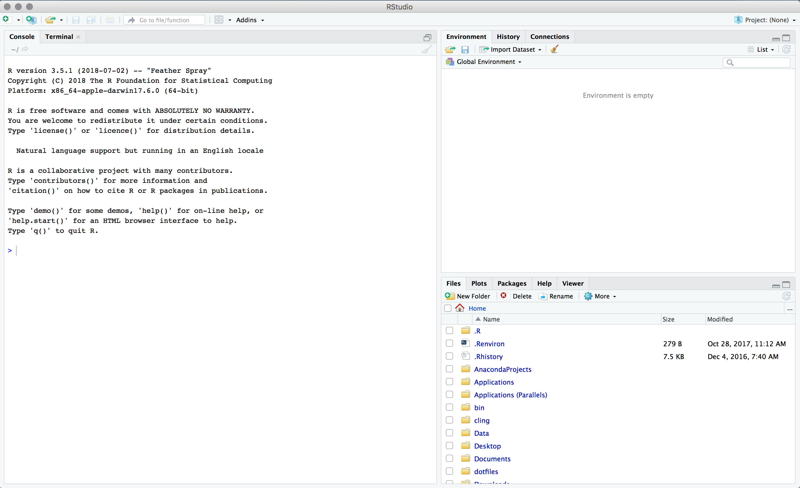
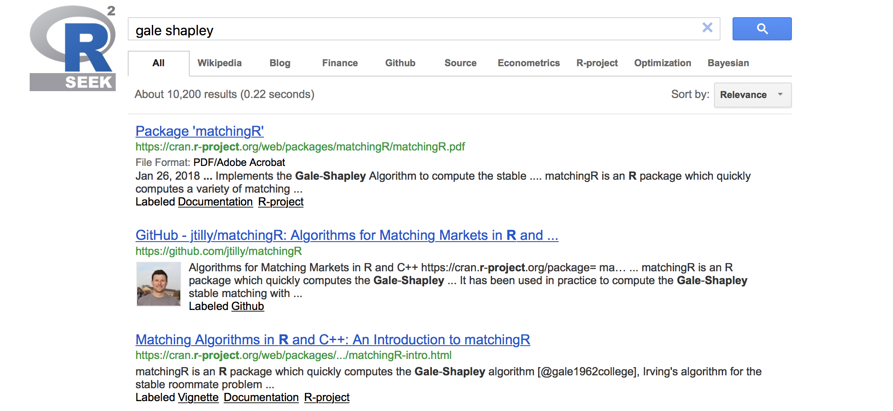
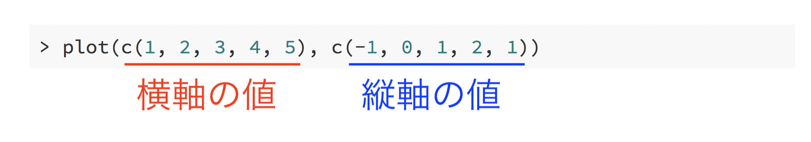

```{r setup, include=FALSE}
knitr::opts_chunk$set(fig.align = 'center')
```

<div style="margin-top: -2.5em"></div>

## Who I am

佐藤健治
- マネ類教員
- 主担当：マクロ経済学
- メール：sato@eco.osakafu-u.ac.jp
    - ただし人に聞かれたくない質問以外は Slack で（後述）
- 研究の関心は
    - 経済成長理論 (なぜ成長が早い国と遅い国があるのか？)
    - 数理経済学 (以下省略)

---

## How I use R

- 講義スライド作成
    - あなたが見ているスライド
- 簡単なウェブサイト
    - [kenjisato.jp](https://kenjisato.jp)
    - [opur.club](https://opur.club) ... 
- 講義資料作成 
    - [経済動学](https://led.kenjisato.jp)
    - [大学院マクロ入門](https://htmlpreview.github.io/?https://github.com/kenjisato/intro-macro/blob/master/doc/r/optimal_growth_dp.html)
- ときどき簡単なデータ分析

「データ分析」がメインの用途ではありませんが，R は結構うまく使えるようになった


---

## 実証研究者との連携

技術的な問題（プログラミング・数学）については佐藤がお答えします。できるだけ。難しい質問は世界の R コミュニティに質問しよう！

応用面での後方支援（データやトピックの提供）はマネ類にいる数多の実証研究者に協力をお願いしています。

プログラミングの基礎的な作法を学びたい人にも，実践的なデータ分析プロジェクトについて知りたい人にも何かしら持って帰っていただけるものと思います！

---

## R Club の目標

コンピュータを使ったデータ分析を

- やらなければならない
- やってみたい
- やりたくない

という人が「プログラミングって楽しい！」と思えるようになること


実践的なデータプログラミング，データ分析のスキルを身につけること。

---


## R Club では学べないこと

- 統計学／計量経済学

コマンド一発で計算できたとしても，理論的な限界に自覚的である方がよい。講義や自習で身につけましょう。

- 分析対象に関する知識

財政なら，例えば，財政関連の法律や行政の仕組みについて知識がないとまともなデータ分析はできない。  
経営についてデータ分析する場合には，会計規則や業界の慣行などの知識を活用すべき。

* ビッグデータ

---

## Slack

（お説教じみた話はこれくらいにして ..... ）


OPU R Club のための Slack チーム  
時間外の質問はこちらへどうぞ。答えられる人が答えてください。

.center.big[

[s.opur.club/join-slack](http://s.opur.club/join-slack)

]

今，JOIN していただけると助かります。

---

## テキスト

OPU R Club のウェブサイト  
テキストはこちら

.center.big[

[opur.club](https://opur.club)

]

---

## 対面講座の構成

.center.big[
  
  説明 30分 ＋ 課題 60分 = 90分

]

トピックは隔週（月2回）で更新

全8回の予定。

<div style="height: 20px"></div>

.center[
  それでは，RStudio を開いてみましょう
]
---

## <i class="fab fa-windows"></i> → rstudio → ⏎

```{r, img-rstudio, echo=FALSE}

```

---

class: fit
background-image: url("images/rstudio-console.png")

---

class: fit
background-image: url("images/rstudio-files.png")


---

## スライド・テキストの読み方

「コンソールに入力して実行してください」というときは「`>`」を付けています。この記号は「プロンプト」といいます。これは入力しないでください。

```{r plot_exp, eval=FALSE, prompt=TRUE}
plot(exp)
```

--

コマンドが1行で完結していない場合には「`+`」記号が付きます。これも入力しないでください。

```{r arithm, eval=FALSE, prompt=TRUE}
10 -
  (3 + 9)
```

コピペしにくいですが，直打ちで筋肉に覚えさせてください。

---

## 試しにやってみよう

`#` の後は「コメント」です。打ち込む必要はありません。

```{r, prompt=TRUE, eval=FALSE}
10 + 5       # 足し算
1 - 3        # 引き算
3 * 0.33     # 掛け算
1 / 4        # 割り算
2 ^ 10       # べき乗
10 %/% 3     # 商
10 %% 3      # 剰余
1 + 2 * 2    # 掛け算・割り算は足し算引き算より優先
(1 + 2) * 2  # 括弧 ( ) で計算の優先順序を変更 
```

---

## 等号に関する注意喚起

2つの値が同じかどうかの判定は `==` を使う（`=` ではない）

```{r, prompt=TRUE}
10 == 10
8 == 7
```


`TRUE` は YES, `FALSE` はNOの意。では次は？

```{r, prompt=TRUE, eval=FALSE}
0.1 + 0.1 == 0.2
0.1 + 0.1 + 0.1 == 0.3
```


---

## 関数

関数というのは，複雑な作業や計算をまとめる仕組みのことです。

数学的な関数の場合もあります。使い方は

```{r, eval = FALSE}
関数名(引数1, 引数2, 引数3)
関数名(引数1, パラメータ名 = 引数)
```

のような形です。引数の数は関数によって異なります。  
例えば `exp()` は指数関数 $e^x$ を計算する関数です。

```{r, prompt=TRUE}
exp(1)
```

---

## クイズ

関数は数学と同じように内側から実行されます。

では，次のコマンドは何を出力するでしょうか？

```{r quiz1, prompt=TRUE, eval=FALSE}
exp(log(sqrt(100)))
```

--

```{r, ref.label="quiz1", echo=FALSE}
```

--

- 括弧を閉じ忘れると `+` が出ます。落ち着いて `)`  を打ち込んでください
- 閉じる括弧が多すぎると `Error: unexpected ')' in ...` と出ます。打ち直しましょう。

---

## 試しにやってみよう

```{r, prompt=TRUE, eval=FALSE}
sqrt(25)
log(2.718282)
log10(10)
log2(1024)
floor(3.5)
ceiling(3.5)
round(exp(1), digits = 3) # 四捨五入
round(2.5, digits = 0)    # ???
```

---

## 関数の組み合わせ

`log10()` は常用対数。数字の桁数を調べるのに便利。

```{r, prompt=TRUE, eval=TRUE}
log10(100)
log10(158034)
```


`floor()` とのコンボ。（`floor(x)` は `x` 以下の最大整数）

```{r, prompt=TRUE, eval=TRUE}
floor(log10(158034)) + 1
```


---

## ヘルプ（関数名が分かる場合）

見慣れない関数が出てきたら 

- `help(関数名)`
- `help("関数名")`
- `?関数名` 

でヘルプを見る習慣をつけましょう。例えば

```{r, eval=FALSE}
?sqrt
```

--
    ... sqrt(x) computes the (principal) square root of x, √{x}.

---

## ヘルプ（関数が分からない場合）

ヘルプの中に出てくるキーワードを検索してくれる関数

- `help.search("keywords")`
- `??"keywords"`


```{r, eval=FALSE, prompt=TRUE}
help.search("linear regression")
```

--

```
Help pages:

datasets::anscombe　Anscombe's Quartet of 'Identical' Simple Linear Regressions
e1071::plot.svm     Plot SVM Objects
...
stats::nlm          Non-Linear Minimization
...
```

ここから地道に探す。`stats::nlm` という書き方は `stats` パッケージの `nlm` という関数（or データ）の意。


---

## `help.search` で見つからない

RSeek <https://rseek.org> を使う。

例えば，「gale shapley」 を検索してみると ....

--

```{r matchingR, out.width=800, echo=FALSE}

```


---

## ヘルプが役立たない場合


`plot(関数名)` で関数のグラフを描けますが，簡単そうに見えて実は `plot()` は結構複雑な仕組みで動いています（S3 generic function）。

なので，ヘルプを探すのが大変なのです。そういうことが時々起こりますので要注意。対処方法を確認しておきましょう。


まずは `plot()` でできることを調べてみましょう。いつでもまずは実験です。

---

## 関数のプロット

```{r plot_exp3, prompt=TRUE, eval=FALSE}
plot(log)
```
--
```{r, ref.label="plot_exp3", echo=FALSE, out.width=400}
```


---

## ベクトルの組のプロット


次回，詳しく扱いますが，R でデータを扱うときの基本は `c()` （combine の c から）です。
例えば `c(1, 2, 3)` とすると，1, 2, 3 を並べたベクトルのことです。

次のコマンドが何をするか当ててみてください。

```{r plot_data, eval=FALSE, prompt=TRUE}
plot(c(1, 2, 3, 4, 5), c(-1, 0, 1, 2, 1))
```

---

```{r, ref.label="plot_data", echo=FALSE}
```

```{r plot_data_fig, out.width=600, echo=FALSE}

```

---

## データのプロット

R にプリインストールされている表形式データ `iris`

```{r, eval=FALSE}
> iris
    Sepal.Length Sepal.Width Petal.Length Petal.Width    Species
1            5.1         3.5          1.4         0.2     setosa
2            4.9         3.0          1.4         0.2     setosa
3            4.7         3.2          1.3         0.2     setosa
...
```

次のコマンドはどのような図を描くでしょうか？


```{r plot-iris, eval=FALSE, prompt=TRUE}
plot(iris)
```

---

```{r, ref.label="plot-iris", prompt=TRUE}
```

---

## `plot()` の正体


`plot()` は「プロットしたい対象」に応じて振る舞いが変わります。


|  コマンド           |  出力              |
|------------------------------------------|
|`plot(関数名)`       |   関数のグラフ     |
|`plot(X座標, Y座標)` |    散布図          |
|`plot(表形式データ)` |   散布図行列       |


他にも色々な振る舞いをします。すべてを理解する必要はまったくありませんが，こういう関数の「ヘルプの調べ方」は知っておいた方がよいでしょう。


---

## `plot()` の正体（つづき）


```{r, eval=FALSE, prompt=TRUE}
?plot
```

```
*Generic X-Y Plotting

Description

*Generic function for plotting of R objects. For more details about 
the graphical parameter arguments, see par.

For simple scatter plots, plot.default will be used. However, there 
are plot methods for many R objects, including functions, data.frames, 
density objects, etc. Use methods(plot) and the documentation for these.

...
```

R で "Generic ..." と出てきたら，「色んな振る舞いをするヤツ」ということを覚えてください。


---

## `plot()` の正体（つづき）

`methods()` という関数を使うと正体が分かります。


```{r methods, prompt=FALSE, eval=FALSE}
methods(plot)
```
--
```{r, ref.label="methods", echo=FALSE}
```

--

`plot.function` が関数のプロットぽい！  
`plot.data.frame` が表形式データのプロットっぽい！


---

## `plot()` の正体（つづき）

ここまで突き止めれば .... 


```{r, eval=FALSE, prompt=TRUE}
?plot.function
```

で実体を見つけられます。`curve()` という別の関数のヘルプに飛ばされますが，これで正解です。

- `plot(関数名)` は実は
- `plot.function(関数名)` を実行するが，これも実は
- `curve(関数名, from = 0, to = 1)` を実行している


ややこしいですが，`plot()` という共通の関数で色んな作業ができることにご利益があるのです。
**今は実体に対するマニュアルの探し方だけ覚えておいてください。**


---

## プロジェクトを作ろう！


[OPU R Club - Lesson 1-2](https://opur.club/textbook/2018-1-2/) を開いてください。
テキストにしたがって，以下を実行してください。

* RClub プロジェクトを作成して開く → [HERE](https://opur.club/textbook/2018-1-2/#project)
   * USBメモリに作ってもOK
* `.Rprofile` の作成 → [HERE](https://opur.club/textbook/2018-1-2/#r-.rprofile)
  * 必須ではありませんが，あった方が安心
* フォルダ構成の決定 → [HERE](https://opur.club/textbook/2018-1-2/#project-structure)
* スクリプト例の実行 → [HERE](https://opur.club/textbook/2018-1-2/#write-run-script)
  * `file.edit()`, `source()` を習得する

---

## 課題説明: スクリプト例3 の応用

```{r, eval=FALSE}
# exponential.R

png("Graphics/exponential.png", height = 1440, width = 1440, res = 216)
# ↑ png(...) で描画開始

plot(exp)

# ↓ dev.off() で描画終了
dev.off()
```


* `Graphics` フォルダに `exponential.png` という画像を作成します。
* 中身は指数関数のグラフで，横軸は 0 から 1 の範囲になっています。
* グラフの色は黒色です。

---

## 課題

スクリプト例3を参考に，以下のようなスクリプトを書いてください。

1. ファイル名 = `logarithm.R` (`R` フォルダ内)
2. <u>1つの図の中に2つの関数を描画</u>する
    - `log` および `log10`
    - <u>横軸は 0 から 5 まで取る</u>
    - <u>`log` は赤色，`log10` は青色で描く</u>
    - （余力があれば）凡例をつけてください
3. 出力する画像は `logarithm.png` （`Graphics` フォルダ内）


---

## 出力例


```{r, echo=FALSE}
colors <- c("red", "blue")
plot(log, 0, 5, col = colors[1])
curve(log10, 0, 5, add = TRUE, col = colors[2])
legend("bottomright", c("log", "log10"), lty = 1, col = colors)
```