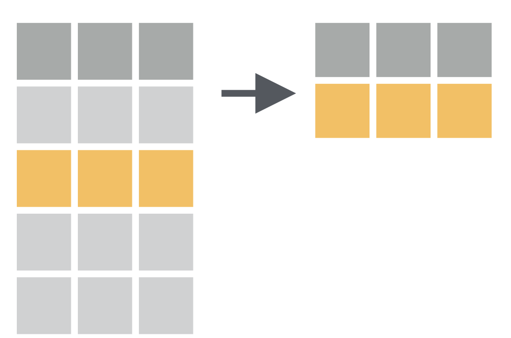
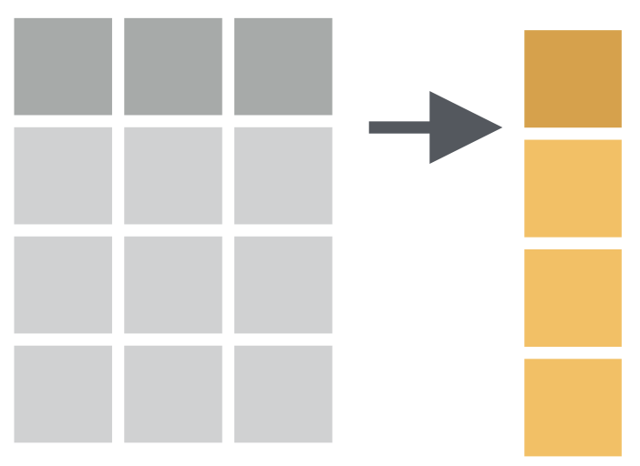
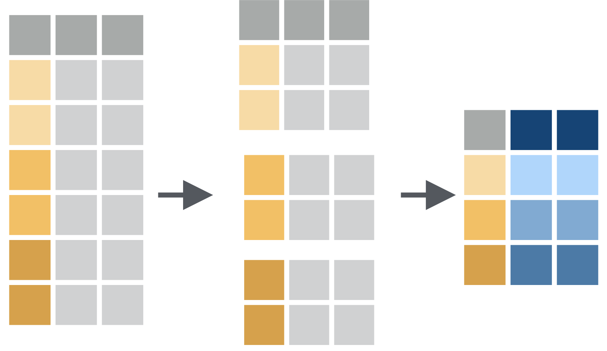
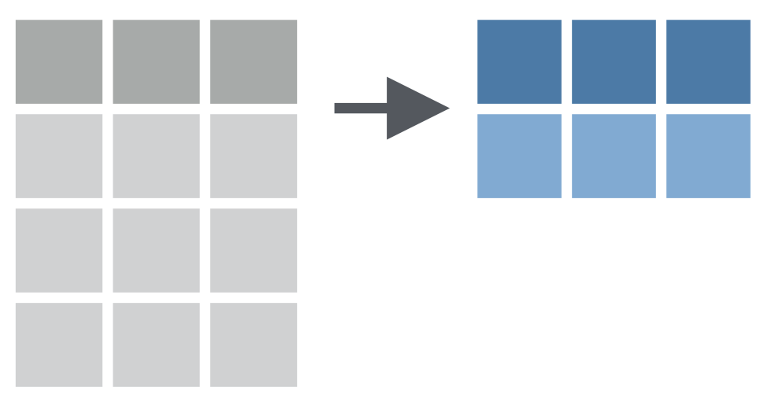
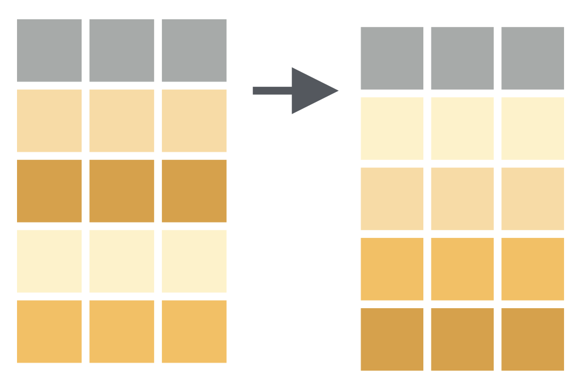

```{r setup, include=FALSE}
knitr::opts_chunk$set(
  fig.align = 'center',
  prompt = FALSE
)
options(width = 63)
```

<div style="margin-top: -2.5em"></div>

## 今日理解するコードの例

```{r, eval=FALSE}
diamonds %>% 
  filter(cut > "Good") %>% 
  select(carat, color, price) %>% 
  ggplot(aes(x = carat, y = price, color = color)) +
  geom_point(alpha = 0.5)
```

---

## トピック

- パイプ
- dplyr によるデータ処理
- ggplot2 による可視化の入門

---

## tidyverse

```{r}
# 自宅でやる場合は，install.packages("tidyverse") を実行
library(tidyverse)
```


---

## パイプ

**magrittr** パッケージのパイプ `%>%` が **tidyverse** のいたるところで使われます。

```{r, eval=FALSE}
入力 %>% 
  関数1() %>% 
  関数2() %>% 
  関数3()
```

パイプラインを通ってガスが送られていくように，データが変形しながら左から右に送られていくイメージ。


パイプ `%>%` の後ろで改行していることに注意。

---

## クイズ

次のコードはなぜ動かない？

```{r, eval=FALSE}
入力 
%>% 関数()
```

--

R は完結したコマンドを確認した時点で即座に実行していくことに注意。

---

## パイプ（つづき）

次の左右2つのコードは同じ意味

.pull-left[
```{r, eval=FALSE}
関数(入力1, 入力2, 入力3)
```
]

.pull-right[
```{r, eval=FALSE}
入力1 %>% 
  関数(入力2, 入力3)
```
]


結果に名前を付けたいときは

```{r, eval=FALSE}
名前 <-
  入力 %>% 
    関数1() %>% 
    関数2()
```


---

## ショートカット

パイプを入力するRStudio のショートカット

.center[
**Ctrl + Shift + M**
]


これを覚えるだけで作業がはかどります

---

## パイプの簡単な例

```{r}
# sqrt(4)
4 %>% sqrt()
```


```{r}
# round(log10(305000), digits = 3)
305000 %>% 
  log10() %>% 
  round(digits = 3)
```


**もちろん普通はこういうことはしません**

---

## クイズ

結果を予想してから実行してください。

```{r, eval=FALSE}
# (1)
2 ^ 100 %>% log2() %>% sqrt()

# (2)
stringr::fruit %>% endsWith("berry") %>% sum()

# (3)
rnorm(100) %>% plot(type = "l")
```


---

## dplyr

「でぃーぷらいやー」

- データ操作のためのパッケージ。
- R の基本関数でやるよりも直感的で分かりやすい。
- 操作方法を覚えたら SQL データベースとの連携も簡単にできるようになる。

---

## データ処理の基本的な流れ

モデル化の前のデータ処理として極めて頻繁に行う処理・・・・

1. 不要な列を落とす  
  （例えば，消費のデータは不要，とか）
1. 不要な行を落とす  
  （例えば，1960年より前のデータはいらない，とか）
1. 既存の列から計算された新しい情報を追加する
  （例えば，文字列のカテゴリ変数を数値（ファクタ）にする）
1. グループごとに集計する
1. 集計結果に応じて並び替える


---

## パイプを使った表現

```{r, eval = FALSE}
新データ名 <-
  データ %>% 
    列を選ぶ(必要な列1, 必要な列2) %>% 
    行を取り出す(条件1, 条件2) %>% 
    列を追加する(新しい列名 = 計算式) %>% 
    グループ化する(グループ化のルール) %>% 
    集計する(集計値の名称 = 集計ルール) %>% 
    並び替える(並び替えルール)
```

それぞれの変換操作に対応する関数を覚えましょう。

---

## データの取得

ここからは実際のデータを使って分析をするために，[Penn World Table](https://www.rug.nl/ggdc/productivity/pwt/kk) をダウンロードします。

1. RClub 用のプロジェクトを開く
1. Data フォルダがなければ作る
1. 次のコマンドをコピペしてコンソールで実行する


```{r, eval = FALSE, prompt = FALSE}
download.file(url = "http://www.rug.nl/ggdc/docs/pwt90.dta", 
              destfile = "Data/pwt90.dta", mode = "wb") 
```


---

## データの読み込み

`Data/PWT90.dta` は STATA 用のファイルなので，`haven` というパッケージを使って読み込みます。

**tidyverse** の一部ですが自動ロードされないので，`haven::` を付けます。


```{r, include = FALSE}
pwt90 <- haven::read_dta("~/Data/pwt90.dta")
```

```{r, eval = FALSE}
pwt90 <- haven::read_dta("Data/pwt90.dta")
```

---

## データの表示

```{r, eval = FALSE, prompt=TRUE}
View(pwt90)
```


大きすぎてあまり役に立たないかも。これから切り分ける方法を勉強します。


変数の意味ですが，`haven::read_dta()` で読み込んだデータにはSTATA の変数情報も一緒に保存されています。ラベルを取り出す方法はココに書いていますのでご一読を

<http://opur.club/textbook/2018-3-1/#pwt-label>


---

## 列の選択 = `select` 

.left-column[

]


.right-column[
```{r}
pwt90 %>% 
  select(country, year, rgdpo)
```

]


---

## `View()` に送ると少し便利

```{r, eval = FALSE}
pwt90 %>% 
  select(country, year, rgdpo) %>% 
  View()
```

```{r, eval = FALSE}
pwt90 %>% 
  select(countrycode, year, pop) %>% 
  View()
```


---

## 行の抽出 = `filter`

.left-column[

]


.right-column[

```{r, include = FALSE}
oopt <- options(width = 42)
```

```{r}
pwt90 %>% 
  filter(country == "Japan")
```

```{r, include = FALSE}
options(oopt)
```

]

---

## `filter` を試してみよう (1)

`%in%` との組み合わせ

```{r, eval = FALSE}
pwt90 %>% 
  filter(country %in% c("United States", "Japan"))
```

コンマで条件を2つつなぐと .... 

```{r, eval = FALSE}
pwt90 %>% 
  filter(country %in% c("United States", "Japan"), year > 2000)
```

欠損値の除去は `!is.na(列名)`

```{r, eval = FALSE}
pwt90 %>% 
  filter(country == "Aruba"), !is.na(rgdpo))
```

---

## `filter` を試してみよう (2)

OR 条件は `|` を使う

```{r, eval = FALSE}
pwt90 %>% 
  filter(pop > 1 | rgdpo > 3000)
```


`filter` と `select` のコンボ

```{r, eval = FALSE}
countries <- c("Japan", "United States", "Republic of Korea")
pwt90 %>% 
  filter(year > 1960, country %in% countries) %>% 
  select(country, year, rgdpo, pop)
```

---

## 変換して追加 = `mutate` 

.left-column[

]


.right-column[

```{r, include = FALSE}
oopt <- options(width = 42)
```

```{r}
pwt90 %>% 
  mutate(rgdpo_pc = rgdpo / pop)
```

```{r, include = FALSE}
options(oopt)
```
]

---

## 変換して `select` = `transmute` 

.left-column[

]


.right-column[

```{r, include = FALSE}
oopt <- options(width = 42)
```

```{r}
pwt90 %>% 
  transmute(country, year, 
            rgdpo_pc = rgdpo / pop)
```

```{r, include = FALSE}
options(oopt)
```
]


---

## ggplot2 による可視化


```{r ggplot-example, eval = FALSE}
countries <- c("Japan", "United States", "Republic of Korea")
pwt90 %>% 
  filter(year > 1960, country %in% countries) %>% 
  transmute(country, year, rgdpo_pc = rgdpo / pop) %>% 
  ggplot(aes(x = year, y = rgdpo_pc, color = country)) + 
    geom_line()
```


- `ggplot()` グラフ領域の作成，デフォルト aes の指定
- `aes()` データを視覚特性に置き換える関数。例えば, `color = country` という指定は `country` 列の
   情報を使って，色 1, 2, 3, ... を決めるということ。
- `geom_line()` 折れ線グラフのレイヤーを作る

---

## 結果

```{r, ref.label="ggplot-example", echo = FALSE, dpi=250, out.width=600, fig.asp=1/1.618}
```

**ggplot2** による可視化は次回以降に詳しく扱う予定です。

---

## グループ化 = `group_by`


.left-column[

]


.right-column[

先ほどの図を見ると，一人あたり実質GDPの成長率にかなり差がありそうだなという気がする。
実際に平均成長率を計算するにはデータのうち `country` 列が同じものをひとまとまりと考えて計算する必要がある。

このときに使うのが， `group_by`

```{r, eval = FALSE}
pwt90 %>% 
  group_by(country)
```

]

---

## 成長率の公式

$Y_0, Y_1, \cdots, Y_N$ の平均成長率というのは，たいてい次の式を満たす $g$ のことを指す：
 $Y_N = (1 + g)^N Y_0$

全期間の成長率の $N$乗根を取るか。（Effective rate）
$$
g = \left( Y_N / Y_0 \right)^{1/N} - 1
$$


対数値の差を期間の長さで割る。（Nominal rate）

$$
g \approx \frac{\log Y_N - \log Y_0}{N}
$$


Nominal rate の方が望ましい性質があるのでこちらを計算する。

---

## 成長率を計算する関数

$$\begin{multline}
\log Y_N - \log Y_0 = \\
(\log Y_N - \log Y_{N-1}) + (\log Y_{N-1} - \log Y_{N-2})\\
+\cdots + (\log Y_1 - \log Y_0)
\end{multline}$$


に注意する。 $\frac{\log Y_N - \log Y_0}{N}$ は階差の算術平均である。

次の関数を定義しておこう。（関数定義の詳細は後日）

```{r}
avggr <- function(x) {
  mean(log(x) - lag(log(x)), na.rm = TRUE)
}
# test
avggr(c(1, 1.1, 1.21))
```

---

## 集計 = `summarize`


.left-column[

]


.right-column[

```{r}
pwt90 %>% 
  filter(year > 1960, 
         country %in% countries) %>% 
  transmute(country, year, 
            rgdpo_pc = rgdpo / pop) %>% 
　group_by(country) %>% 
  summarize(rate = avggr(rgdpo_pc))
```

]

---

## 並べ替え = `arrange`

.left-column[

]


.right-column[

```{r}
pwt90 %>% 
  filter(year > 1960, 
         country %in% countries) %>% 
  transmute(country, year, 
            rgdpo_pc = rgdpo / pop) %>% 
　group_by(country) %>% 
  summarize(rate = avggr(rgdpo_pc)) %>% 
  arrange(desc(rate))
```

]


---

## まとめ

**dplyr** の動詞: 
- `filter`
- `select`
- `mutate`, `transmute`
- `group_by` + `summarize`, 
- `arrange` 

を学んだ。これらをパイプでつなげて表形式データを加工できるようになった。

---

## 課題

- PWT v9.0 の全データを用いて，1980年以降の人口成長率が最も高かった国上位3カ国を特定せよ。
- PWT v9.0 のOECD 加盟国（次のページ）のデータを用いて，1985年から2014年の期間で1人あたり実質GDPの平均年率成長率を計算し，
  成長率の高い順に並べなさい。
- 1960年から1985年に限定すると，平均成長率上位はどうなるか？


---

## OECD

<http://www.oecd.org/about/membersandpartners/>

```{r}
oecd <- c("Australia", "Austria", "Belgium", "Canada", "Chile", 
  "Czech Republic", "Denmark", "Estonia", "Finland", "France", 
  "Germany", "Greece", "Hungary", "Iceland", "Ireland", "Israel", 
  "Italy", "Japan", "Republic of Korea", "Latvia", "Lithuania", 
  "Luxembourg", "Mexico", "Netherlands", "New Zealand", "Norway", 
  "Poland", "Portugal", "Slovakia", "Slovenia", "Spain", 
  "Sweden", "Switzerland", "Turkey", "United Kingdom", 
  "United States")
```


