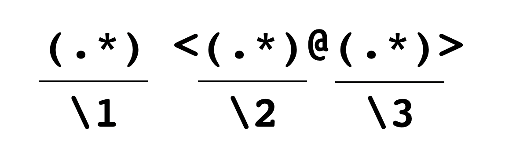

```{r setup, include=FALSE}
knitr::opts_chunk$set(
  fig.align = 'center',
  out.height = 400,
  fig.asp = 1/1.618,
  dpi = 196,
  prompt = FALSE
)
options(width = 63)
```

<div style="margin-top: -2.5em"></div>

## Cheat Sheet

<https://www.rstudio.com/resources/cheatsheets/#stringr>

本日は，「Work with Strings Cheat Sheet」をお手元にご用意ください。


---

## トピック

- R の文字列
- stringr
- 正規表現

---

## tidyverse

- R プロジェクトを開く
- **tidyverse** をロードする

```{r}
# 自宅でやる場合は，install.packages("tidyverse") を実行
library(tidyverse)
```

---

## 文字列

「文字列」（string）というのは，文字（a, b, c,... 0, 1, 2,..., あ, い, ...など）の1つ以上の並びのことです。

- Webサイト
- SNS
- 本
- CSV ファイルなどなどなど

こういったデータからうまく数値化できる情報を取り出して分析したい

---

## 文字列の表現

R は一対の二重引用符(`" "`)または一重引用符（`' '`）で括られたテキストを「文字列」と認識します。

次の2つのコマンドを実行して比較してください。


```{r simple-calc, eval = FALSE}
3 + 4
"3 + 4"
```

---

## 引用符のネスト

次のコードには問題があります。それは何でしょうか？

```
""Good morning", he said."
```

どのように解決すればいいでしょうか？

--

1つの答え： 1重引用符でくくる。

```{r string-with-single}
'"Good morning", he said.'
```

出力では内側の二重引用符が `\"` と表記されていることに注意。

---

## エスケープシーケンス `\"`

`"` は文字列の区切りに使われるので，「`"` という文字そのもの」を表す特別な方法が必要で，これが `\"` です。

テキストの中に `"` と `'` が両方現れる場合にはエスケープシーケンスを使う必要があります。

問題: 次のコードを修正し，テキストをオブジェクト `x` にアサインしてください。

```
x <- ""That's a strange thing," remarked my companion."
```

```{r, include = FALSE}
x <- "\"That's a strange thing,\" remarked my companion."
```
---

## `writeLines()`

`print()` された結果はエスケープシーケンスがあると人間には読みにくいので，
`writeLines()` という関数を使います。

```{r}
writeLines(x)
```


次のコードを実行して結果を説明してください。

```{r, eval = FALSE}
writeLines(c("1. Knowledge of Literature.—Nil.",
             "2.              Philosophy.—Nil.",
             "3.              Astronomy.—Nil."))
```

---

## その他のエスケープシーケンス

```{r, prompt = FALSE, eval = FALSE}
writeLines("A Study In Scarlet\nArthur Conan Doyle")
writeLines("Apple\t100\nOrange\t50")
writeLines("C:\\Users\\Kenji\\Documents")
writeLines(c("A \U27FA B", "\U1F600", "\U1F640"))
```

---

## **stringr**

**stringr** は文字列ベクトルを操作するための関数を集めたパッケージです。例えば，次のような関数が用意されています。

- 長さ `str_length()` 
- 連結 `str_c()`, `str_flatten()`
- 分解 `str_split()`
- 部分の抽出 `str_sub()`
- 空白の除去 `str_trim()`, `str_squish()`
- 大文字小文字の変換 `str_to_lower()`, `str_to_upper()`, `str_to_title()`

---

## 例 1

```{r}
(x <- c("apple", "banana", "orange"))
```

```{r, eval = FALSE}
str_length(x)
str_c(x, "s")
str_flatten(x, collapse = ":")
str_split("R is fun!", pattern = boundary("word"))
str_sub(x, start = 2, end = 4)
```

すべて `str_` から始まるので，関数の名前を忘れてしまったら `str_` まで入力して TAB キーを押下しましょう。RStudio が候補を教えてくれます。

---

## 例 2

```{r}
(y <- c("   Hello, world!  ", "Good        morning"))
str_trim(y)
(z <- str_squish(y))
```

---

## 例 3

```{r}
str_to_lower(z)
str_to_upper(z)
str_to_title(z)
```
---

## シャーロック・ホームズ

グーテンベルクプロジェクトから A Study in Scarlet をダウンロードします。 **gutenbergr** をインストールして， `gutenbergr::gutenberg_donwload()` を使います。

```{r}
# install.packages("gutenbergr")
study_in_scarlet <- gutenbergr::gutenberg_download(244) 
text <- 
  study_in_scarlet %>% 
  filter(row_number() > 32) %>% 
  pull(text)
```

---

## 単語の出現頻度: `table()`

単語の出現頻度を調べてみましょう。 `base::table()` を使うと便利です。これは次のように使います。

```{r}
(x <- sample(c("a", "b", "A"), size = 10, replace = TRUE))
table(x)
```

---

## 単語の出現頻度（つづき）

テキストが与えられているときは， `str_split(pattern = boundary("word"))` で単語のベクトルに変換して，
`str_to_lower()`で小文字に変換してから `table()` に適用します。

```{r}
sample.text <- "This is a pen." 
sample.vec <-  unlist(str_split(sample.text, boundary("word")))
sample.lower <- str_to_lower(sample.vec)
  
table(sample.lower)
```

`str_split()` は「リスト」を返すのでそれをベクトルに変換（`unlist()`）

---

## 緋色の研究の単語

```{r}
words <- 
  text %>% 
  str_to_lower() %>% 
  str_flatten(collapse = "\n") %>% 
  str_split(boundary("word"))
```

これに `table` を適用します。最後に `tibble()` に変形して，整列しておきます。

```{r}
freq <- words %>%
  table() %>% 
  tibble(word = names(.), n = .) %>%      ## . は左辺のデータ
  mutate(n = as.integer(n)) %>% 
  arrange(desc(n))
```

---

## 緋色の研究の単語

```{r, eval = FALSE}
View(freq)
```

```{r, echo = FALSE}
head(freq)
```


---

## クイズ

(1) 以下のコードは何を出力するか？予想したあとに，実行しなさい。

```{r, eval = FALSE}
freq %>% 
  filter(rank(desc(n)) <= 50) %>% 
  ggplot() + 
  geom_col(aes(x = reorder(word, n), y = n)) + 
  coord_flip()
```


(2) "sherlock", "holmes", "watson", "john" の出現頻度を調べなさい。

---

## 正規表現：動機

例えば，次のようなテキストファイルがあったとしましょう。

```
Alice <alice@example.com>
Bob <bob@example.org>
Charlie <charl@example.net>
```

このテキストファイルを次のような表形式データに変換したいとすればどうしますか？

| name    | user  | domain      |
|---------|-------|-------------|
| Alice   | alice | example.com |
| Bob     | bob   | example.org |
| Charlie | charl | example.net |

---

## 正規表現でできること

上の例では，行ごとに内容は違うものの，次のような明確なパターンがありました。

```
name <user@domain>
```

このように一定のパターンに従う文字の並びを探し出して，処理を実行するのが正規表現の役割です。

---

## テキストエディタで実験

RStudio で新しい「Text File」を作成し，

```
Alice <alice@example.com>
Bob <bob@example.org>
Charlie <charl@example.net>
```

をコピーしてください。

---

## テキストエディタで実験（つづき）

Ctrl+F （Mac なら Comman+F） を押すと検索窓が現れますので，

1) "Regex" にチェックを入れる  
2) 左の入力フォーム（検索欄）に「`(.*) <(.*)@(.*)>`」  
3) 右の入力フォーム（置換欄）に「`\1,\2,\3`」を入力

して，「All」をクリックしてください。

何が起こりましたか？

---

## 文字を表す正規表現

| 探しもの       | regex   | R       |
|----------------|---------|---------|
| 特定の文字列   | `abc`   | `abc`   |
| 任意の文字     | `.`     | `.`     |
| 数字（その1）  | `[0-1]` | `[0-1]` |
| 数字（その2）  | `\d`    | `\\d`   |
| 記号を除く文字 | `\w`    | `\\w`   |
| 記号           | `\W`    | `\\W`   |
| ピリオド       | `\\.`   | `\.`    |


正規表現 `\d+-\d+-\d+` は電話番号が記録されているデータがあったときに携帯電話の割合を調べるのに使えそうです

---

## グループ

| グループ         | regex           |
|------------------|-----------------|
| どれか1つ        | `[abc]` など    |
| どれでもない     | `[^abc]` など   |
| この並びで現れる | `(abc)` など    |
| いずれか         | `(ab`&#x7C;`cd)` など  |


---

## 量を表す正規表現

| 量               | regex   |
|------------------|---------|
| 0個以上          | `*`     |
| 1個以上          | `+`     |
| 0 or 1           | `?`     |
| n個              | `{n}`   |
| n個以上          | `{n,}`  |
| n個以下          | `{,n}`  |
| m個以上，n個以下 | `{m,n}` |

---

## 位置を表す正規表現

| 位置     | regex | R     |
|----------|-------|-------|
| 行頭     | `^`   | `^`   |
| 行末     | `$`   | `$`   |
| 単語境界 | `\b`  | `\\b` |

---

## 後で使う

丸括弧（`( )`）は丸括弧は，「後で使えるようにしたりするため」にも使われる。
最初に現れた `( )` に該当する部分を `\1` で呼び出すことができます。


さきほどの例では

```{r, img-ref, echo=FALSE, out.height=130}

```

---

## tibble にする

それでは例題のデータを tibble に変換してみましょう。

```{r}
dta <- "Alice <alice@example.com>
Bob <bob@example.org>
Charlie <charl@example.net>"
# writeLines(dta)
```

```{r}
address <- 
  dta %>% 
  str_split("\n") %>% 
  unlist()
address
```

---

## tibble にする（つづき）

`str_match()` を使って，検索をします。

```{r}
match_matrix <- 
  address %>% 
  str_match("(.*) <(.*)@(.*)>") 
match_matrix
```


---

## tibble にする（つづき）

matrix を tibble に変換すれば完了です。

```{r}
users <- as_tibble(match_matrix[, 2:4])
names(users) <- c("name", "user", "domain")
users
```

