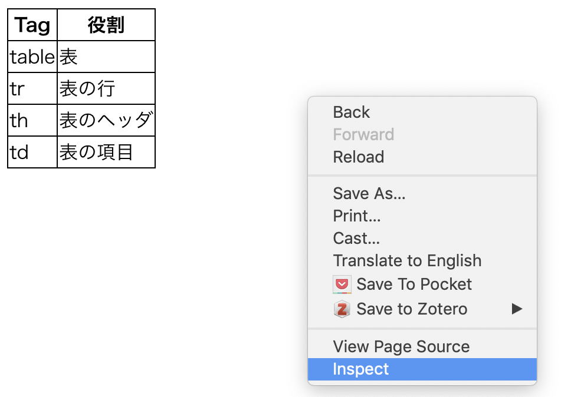
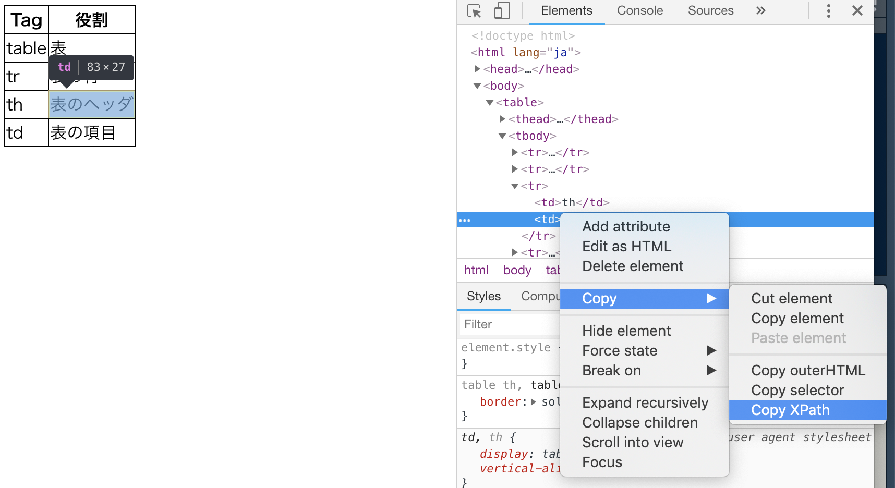

```{r setup, include=FALSE}
knitr::opts_chunk$set(
  fig.align = 'center',
  out.height = 400,
  fig.asp = 1/1.618,
  dpi = 196,
  prompt = FALSE
)
options(width = 63)
```

<div style="margin-top: -2.5em"></div>

## トピック

- HTML の基本
- rvest による Web スクレイピング

---

## 準備

```{r, eval = FALSE}
install.packages("servr")
install.packages("rvest")
```

---

## HTML の基本構造

ウェブサイトは HTML という書式ルールを使って書く。  
次のような文書をしている。

```html
<!DOCTYPE html>
<html lang="ja">
  <head>
    <!-- ここに設定情報など -->
  </head>
  <body>
    <!-- ここにコンテンツ -->
  </body>
</html>
```


---

## タグ

`<tag> ... </tag>` は文書内の役割を表現する。 

- `<html></html>` HTML文書
- `<head></head>` ヘッダ
- `<body></body>` 本文
- `<h1></h1>`, `<h2></h2>` ... 見出し
- `<p></p>` 段落
- `<a></a>` ハイパーリンク, etc. etc....

---

## 作ってみよう! 

R プロジェクトを開いて次のコマンドを実行

```{r, eval = FALSE}
dir.create("site")   # site フォルダ作成
file.edit("site/index.html")  # index.html ファイル作成
```

「Terminal」で R を起動, web サーバーを立ち上げる。

```{r, eval = FALSE}
$ R
...
> servr::httd("site")
To stop the server, run servr::daemon_stop("140.....") or 
restart your R session
Serving the directory ..../site at http://127.0.0.1:4321
```


---

## Web サーバーを立ち上げる

Web サーバーというのは，ブラウザなどのソフトウェアから要求を受けてHTMLファイルなどの情報を送り返すサービスのこと。

今，みなさんが作った `site` フォルダ上においたファイルをウェブブラウザで見ることができるようになりました: 

<http://127.0.0.1:4321>

`127.0.0.1` というのは自分自身のコンピュータを指す特別なアドレス。`:4321` はポート番号（普通は 80 だけどテストのため特別な番号を割り当てている）

---

サンプル

```html
<!DOCTYPE html>
<html lang="ja">
  <head>
    <meta http-equiv="Content-Type" 
          content="text/html; charset=UTF-8">
  </head>
  <body>
    <h1>R Club</h1>
    <p>
      R Club は R の勉強会です。
    </p>
    <p>
      本日はウェブサイトの作り方を勉強しています。
    </p>
    <ul>
      <li>HTML</li>
      <li>CSS</li>
      <li>JavaScript</li>
    </ul>
  </body>
</html>
```

---

## リンク

次のように修正（a タグの追加）してください。

```html
<ul>
  <li><a href="about-html.html">HTML</a></li>
  <li>CSS</li>
  <li>JavaScript</li>
</ul>
```

ファイルを作ります。

```{r, eval = FALSE}
file.edit("site/about-html.html")
```

`<body></body>` の中に次のように書いてください。

---

```html
    <table>
      <thead>
        <tr>
          <th>Tag</th>
          <th>役割</th>
        </tr>
      </thead>
      <tbody>
        <tr>
          <td>table</td>
          <td>表</td>
        </tr>
        <tr>
          <td>tr</td>
          <td>表の行</td>
        </tr>
        <tr>
          <td>th</td>
          <td>表のヘッダ</td>
        </tr>
        <tr>
          <td>td</td>
          <td>表の項目</td>
        </tr>
      </tbody>
    </table>
```


---

## 属性

`<a></a>` に対する `href` のようなもの。

`class` と `id` が特に重要。

- `class` はグループ分け。複数のタグが同じ `class` 属性を持てる
- `id` は一意な識別。複数のタグが同じ `id` 属性を持てない。


```{r, eval=FALSE}
file.edit("site/about-css.html")
file.edit("site/style.css")
```

---

`style.css`

```
.space {
  height: 1200px;
}
```

---

`about-css.html` 

```
<!DOCTYPE html>
<html lang="ja">
  <head>
    <meta http-equiv="Content-Type" content="text/html; charset=UTF-8">
    <link rel="stylesheet" type="text/css" href="style.css">
  </head>
  <body>
    <h1>CSS</h1>
    <h2 id="basics">CSS の基本</h2>
    <div class="space"></div><!-- 無意味な空白 -->
    
    <h2 id="application">CSS の応用</h2>
    <div class="space"></div><!-- 無意味な空白 -->
    
    <h2 id="future">CSS の未来</h2>
    <div class="space"></div><!-- 無意味な空白 -->
    
    <a href="/">home</a>
  </body>
</html>
```

<http://127.0.0.1:4321#application>


---

## CSS

CSS はサイトのデザインをコントロールするもの。

HTMLファイルの `<head></head>` の中に，

```
<link rel="stylesheet" type="text/css" href="style.css">
```

といった記述をすることで，CSSファイルに定義されたスタイルが適用される。

`style.css` に次の記述を追加してみよう。（1つ確認しては，消して次のものを追加する）

```
h1 { color: red; }
h2 { color: red; }
#application { color: red; }
```

---

## CSS (続き)

ドットは class, ハッシュタグは id 属性

タグの階層構造はスペースでつなぐ（最下層だけでもOK）  
複数のルールに同じデザインを適用するときはコンマ

```
section p .red {
  color: red; /* などなど */
}

table {
  border-collapse: collapse;
}
table th, table td {
  border: solid 1px black;
}
```

`about-html.html` にこのCSSを適用してみよう。

---

## 練習

CSS の適用ルールを練習できるウェブアプリ

<http://flukeout.github.io/>


HTML 文書からデータを取得するときにも似たような考え方を使う。

---

## 要素の検証

```{r, echo = FALSE}

```

---

## 要素の検証（つづき）

```{r, echo = FALSE}

```

---

## HTML 文書からデータ取得

```{r, message = FALSE}
library(tidyverse)
library(rvest)
```

マネジメント学類シラバス

<http://www0.osakafu-u.ac.jp/syllabus/list01.aspx?CD1=2B11&CD2=03>

---

## 注意！ DoS攻撃について

**Denial of Service Attack**

プログラム的にWebサーバーに大量にリクエストを送ってサーバーをダウンさせてしまう攻撃。
Web スクレイピングには意図せずサーバーを攻撃してしまう危険があるので注意すること。

```{r, eval=FALSE}
Sys.sleep(3)
```

ゆっくり実行すること。

robots.txt についても調べておくこと。


---

## 準備

1. まずは要素を検証して
2. HTML の構造を見極める
3. データ取得の戦略を練る
4. コーディングする

---

## rvest

```{r}
root <- "http://www0.osakafu-u.ac.jp/syllabus"
mng_url <- file.path(root, "list01.aspx?CD1=2B11&CD2=03")
mng <- read_html(mng_url)

html_structure(mng)
```


---

## リンクのリスト

```{r}
links <- html_nodes(mng, css = ".li1")
head(links)
```

---

## リンクの下の a タグ


```{r}
link_atag <- html_nodes(mng, css = ".li1 a")
head(link_atag)
```

---

## href 属性

```{r}
link_href <- html_attr(link_atag, "href")
head(link_href, 20)
```

`list02` で始まっているのはページ内リンクなので，除去。

```{r}
syllabus_url <- link_href[!startsWith(link_href, "list")]
```

---

## 調べるアドレス一覧

```{r}
length(syllabus_url)
head(syllabus_url, 20)
```

---

## 単一のページの構造

ミクロ経済学入門 

<http://www0.osakafu-u.ac.jp/syllabus/detail.aspx?CD=5950>

ページトップにある表を取得するには？

要素の検証をしてみよう！

---

## 例

```{r}
course <- "http://www0.osakafu-u.ac.jp/syllabus/detail.aspx?CD=5950"
course_html <- read_html(course)
course_tbl <- html_node(course_html, "table")

course_tbl %>% 
  html_node("#lbl_KAMOKU_NM") %>% 
  html_text()

course_tbl %>% 
  html_node("#lbl_GAKKI_NM") %>% 
  html_text()
```

---

## 単一のページのデータ取得

```{r}
course_info <- function(url) {
  course_html <- read_html(url)
  course_tbl <- html_node(course_html, "table")
  
  ids <- c("#lbl_KAMOKU_NM", "#lbl_HAITO", "#lbl_WJ_NM",
           "#lbl_GAKKI_NM", "#lbl_KYOIN_NM")
  
  vapply(ids, function(id) {
    course_tbl %>% html_node(id) %>% html_text()
  }, character(1))
}

course_info(course)
```


---

## 全ページのデータ取得

`for` ループを使う。`Sys.sleep()` を忘れないように！

```{r}
syllabus_sml <- file.path(root, syllabus_url[201:205])
len <- length(syllabus_sml)

result <- tibble(
  title = vector("character", len),
  year = vector("character", len),
  period = vector("character", len),
  semester = vector("character", len),
  professor = vector("character", len)
)

for (i in seq_along(syllabus_sml)) {
  result[i, ] = course_info(syllabus_sml[i])
  Sys.sleep(3)
}
```

---

## 結果

```{r}
result
```