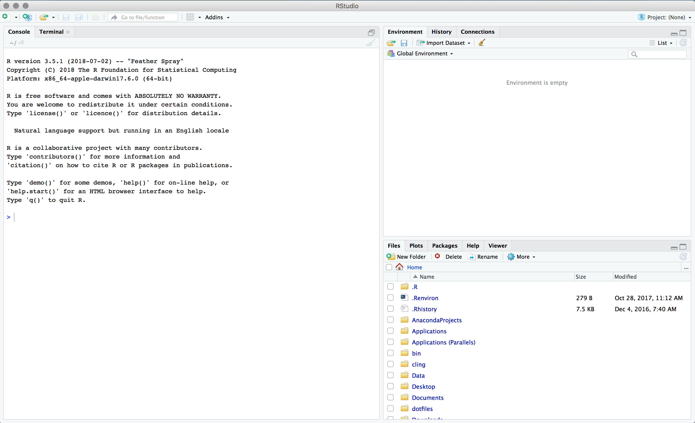

```{r setup, include=FALSE}
knitr::opts_chunk$set(fig.align = "center")
options(width = 63)
```

## Who I am

佐藤健治
- マネ類教員
- 主担当：マクロ経済学
- メール：sato@eco.osakafu-u.ac.jp
    - ただし人に聞かれたくない質問以外は Slack で（後述）

---

## How I use R

- 講義スライド作成
- 簡単なウェブサイト
    - [kenjisato.jp](https://kenjisato.jp)
    - [opur.club](https://opur.club) ... 
- 講義資料作成 
    - [経済動学](https://led.kenjisato.jp)
    - [大学院マクロ入門](https://kenjisato.github.io/intro-macro/doc/r/optimal_growth_dp.html)
- ときどき簡単なデータ分析

---

## Slack

OPU R Club のための Slack チーム  
時間外の質問はこちらへどうぞ。答えられる人が答えてください。

.center.big[

[s.opur.club/join-slack](http://s.opur.club/join-slack)

]

資料を更新したときに通知したり，急なお休みの連絡にも使います。
今，JOIN していただけると助かります。

---

## テキストと計画

[奥村晴彦『Rで楽しむ統計』](https://www.amazon.co.jp/R%E3%81%A7%E6%A5%BD%E3%81%97%E3%82%80%E7%B5%B1%E8%A8%88-Wonderful-R-%E5%A5%A5%E6%9D%91-%E6%99%B4%E5%BD%A6/dp/4320112415)

R にも流行があります。この本では経験豊富な著者が長年変わらぬ部分だけを紹介してくれているので安心です。少しマニアックな内容がふんだんに盛り込まれていますが，よく分からない部分にこだわらずにどんどん進みましょう。

RClub の進行計画は [このGoogle Sheet](https://docs.google.com/spreadsheets/d/1CIMRqvGLlA9kMO9xhKOiHc6ONSgAHI-PSEoeX8mCoLQ/edit?usp=sharing) を確認してください。  


---

## <i class="fab fa-windows"></i> → rstudio → ⏎

```{r, img-rstudio, echo=FALSE}

```

---

class: fit
background-image: url("images/rstudio-console.png")

---

class: fit
background-image: url("images/rstudio-files.png")


---

## スライド・テキストの読み方

「コンソールに入力して実行してください」というときは「`>`」を付けています。この記号は「プロンプト」といいます。これは入力しないでください。

```{r plot_exp, eval=FALSE, prompt=TRUE}
plot(exp)
```

--

コマンドが1行で完結していない場合には「`+`」記号が付きます。これも入力しないでください。

```{r arithm, eval=FALSE, prompt=TRUE}
10 -
  (3 + 9)
```

コピペはせずに，コマンドを筋肉に覚えさせよう。

---

## 試しにやってみよう

`#` の後は「コメント」です。打ち込む必要はありません。

```{r, prompt=TRUE, eval=FALSE}
10 + 5       # 足し算
1 - 3        # 引き算
3 * 0.33     # 掛け算
1 / 4        # 割り算
2 ^ 10       # べき乗
10 %/% 3     # 商
10 %% 3      # 剰余
1 + 2 * 2    # 掛け算・割り算は足し算引き算より優先
(1 + 2) * 2  # 括弧 ( ) で計算の優先順序を変更 
```

---

## 変数

$$\frac{1 + 2 + 3 + 4 + 5}{(0.5^2) / 2}$$

```{r, prompt=TRUE}
分子 = 1 + 2 + 3 + 4 + 5
分母 = (0.5 ^ 2) / 2
分子 / 分母
```


--

```{r eval=FALSE}
名前 = 式  # または
名前 <- 式  
```

で値，計算結果に名前を付けられる。変数またはオブジェクト

---

## ベクトル

```{r, prompt=TRUE}
(x = 5:70)      # この括弧は「代入した後に値を表示する」の意味
```


```{r, prompt=TRUE}
1:10
sum(1:100)
```


---

## 乱数（あるいは疑似乱数）

`rnorm(n, ...)` は正規分布に従う乱数を `n` 個作る。  
`hist()` はヒストグラム

```{r hist, prompt=TRUE, cache=FALSE, out.width=300, dpi=160}
m = 35
s = 2
x = rnorm(100000, mean = m, sd = 2)
hist(x, col="gray")
```

---

## 確率分布関連の関数の命名規則

```{r, eval=FALSE}
d.... => 密度関数 (density)
p.... => 累積分布関数 (probability)
q.... => 分位関数 (quantile)
r.... => 疑似乱数生成器 (random)
```

正規分布（normal distribution）の例
```{r, eval=FALSE}
dnorm(0)      # 密度関数の x = 0 の値
pnorm(0)      # 累積分布関数の x = 0 の値
qnorm(0.975)  # 累積分布関数が 0.975 になる x の値
rnorm(2)      # 正規乱数を2個生成
```

---

## 正規分布に従う乱数: rnorm(n)

```{r rnorm, out.width=700, fig.asp=0.6, dpi=160, echo=FALSE}
opar <- par(mgp = c(1, 0.1, 0), mar = c(1, 1, 1, 1))

set.seed(100)
xaxpos <- - 0.001
xaxmin <- -4.5
xaxmax <- 4.5

X = 1.2
x <- seq(-4, 4, by = 0.05)

# rnorm

plot(NULL, axes = FALSE, xlab = "", ylab = "", xlim = range(x), ylim = c(-0.02, dnorm(0)), lwd = 2)
curve(dnorm, from = min(x), to = max(x), lwd = 2, add = TRUE)
arrows(xaxmin, xaxpos, xaxmax, xaxpos, xpd = TRUE, lwd = 2, length = 0.1)
rs = rnorm(50)
for (r in rs) {
  segments(r, xaxpos - 0.01, r, xaxpos + 0.01)
}
text(0, 0.1, "rnorm(n)", pos = 1, cex = 1.4)

par(opar)
```

---

## 累積分布関数: pnorm(q)

```{r pnorm, out.width=700, fig.asp=0.6, dpi=160, echo=FALSE}
opar <- par(mgp = c(1, 0.1, 0), mar = c(1, 1, 1, 1))

plot(NULL, axes = FALSE, xlab = "", ylab = "", xlim = c(-4, 4), ylim = c(-0.02, dnorm(0)), lwd = 2)
polygon(c(x[x < X], X), c(dnorm(x[x < X]), 0), col = rgb(1, 0, 0, 0.2), lty = 0)
curve(dnorm, from = - 4, to = 4, lwd = 2, add = TRUE)
arrows(xaxmin, xaxpos, xaxmax, xaxpos, xpd = TRUE, lwd = 2, length = 0.1)
text(X, -0.02, "q", cex = 1.4)
text(0, 0.8 * dnorm(X), "pnorm(q)", pos = 3, cex = 1.4)

par(opar)
```


---

## 逆累積分布関数: qnorm(p)

```{r qnorm, out.width=700, fig.asp=0.6, dpi=160, echo=FALSE}
opar <- par(mgp = c(1, 0.1, 0), mar = c(1, 1, 1, 1))

plot(NULL, axes = FALSE, xlab = "", ylab = "", xlim = c(-4, 4), ylim = c(-0.02, dnorm(0)), lwd = 2)
polygon(c(x[x < X], X), c(dnorm(x[x < X]), 0), col = rgb(1, 0, 0, 0.2), lty = 0)
curve(dnorm, from = - 4, to = 4, lwd = 2, add = TRUE)
arrows(xaxmin, xaxpos, xaxmax, xaxpos, xpd = TRUE, lwd = 2, length = 0.1)
text(X, -0.02, "qnorm(p)", cex = 1.4)
text(0, 0.8 * dnorm(X), "p", pos = 3, cex = 1.4)

par(opar)
```

---

## 検定のアイデア

```{r stattest, out.width=700, fig.asp=0.6, dpi=160, echo=FALSE}
opar <- par(mgp = c(1, 0.1, 0), mar = c(1, 1, 1, 1))

plot(NULL, axes = FALSE, xlab = "", ylab = "", xlim = c(-4, 4), ylim = c(-0.02, dnorm(0)), lwd = 2)
polygon(c(x[x > X], X), c(dnorm(x[x > X]), 0), col = rgb(1, 0, 0, 0.2), lty = 0)
polygon(c(x[x < -X], -X), c(dnorm(x[x < -X]), 0), col = rgb(1, 0, 0, 0.2), lty = 0)
curve(dnorm, from = - 4, to = 4, lwd = 2, add = TRUE)
arrows(xaxmin, xaxpos, xaxmax, xaxpos, xpd = TRUE, lwd = 2, length = 0.1)
text(X, -0.02, "qnorm(1-p/2)", cex = 1.4)
text(X + 0.3, 0.04, "p/2", pos = 3, cex = 1.4)

par(opar)
```

---

## 検定のアイデア

特定の仮定（「帰無仮説」）のもとで，正規分布にしたがうはずのデータがピンクのところに入る  
→ 確率が低い現象が起きた  
→ 仮定が間違っているのではないか？


現実のデータが「正規分布に従うことが分かっている」なんてことがあるのか？

---

## 標準化と中心極限定理

$X_i$, $i=1,\dots,n$ が平均 $\mu$, 分散 $\sigma^2$ なる同一の分布から独立に抽出されていれば，標本平均 

$$
\bar{X} = \frac{1}{n} \sum_{i}^n X_i
$$
は平均 $\mu$ で分散は $\sigma^2 / n$ である。（覚えてしまおう！）

$n$ が大きければ， $\bar X$ から平均を引いて標準偏差で割った

$$
Z = \frac{\bar{X} - \mu}{\sqrt{\sigma^2 / n}}
$$

は標準正規分布（平均ゼロ，分散1）に似ている。

---

## 試してみよう

- [0, 1) 上の一様分布: 平均は 1/2, 分散は 1/12 
- `runif(n)` 上の一様分布に従う乱数を生成。標本平均は `mean()` で計算できる

```{r}
n = 10000
z = (mean(runif(n)) - 0.5) / sqrt((1/12) / n)
z
```

これで $Z$ の1つの実現値ができる。繰り返すのはコンピュータの得意技。R の `replicate()` が使える。


---

## 試してみよう（続き）

`replicate()` を使った繰り返し処理

```{r}
Z = replicate(1000, mean(runif(n)) - 0.5) / sqrt((1/12) / n)
head(Z)
```

これで長さ $\bar X$ という確率変数を標準化した $Z$ の 1,000個の実現値を作れた。


---

## 試してみよう（最後）

```{r hist2, out.width=400, dpi=160}
hist(Z, col = "gray")  # 正規分布っぽい形をしているはず
```


---

## シミュレーションと実データ分析

- シミュレーション
   - 人工的にデータ（確率変数）を作って数学モデルの振る舞いを調べること
- 実データ分析
   - 実験や観察から実際に収集したデータを分析すること


本当は実データの分析をしたいのだけど，技法を学ぶためにシミュレーションをすることも沢山あります。

---

## R のヘルプ

```{r, eval=FALSE}
?mean
```


---

## データフレーム (奥村 p. 6)

表の「列」を並べたもの。

```{r}
身長 = c(168.5, 172.8, 159.0)
体重 = c(69.5, 75.0, 56.5)
X = data.frame(身長, 体重)
X
X$身長
```

---

## データフレーム（続き）

列の追加

```{r}
X$BMI = round(X$体重 / (X$身長 / 100)^2)
X
```

---

## パッケージ（Excelファイル）

データフレームを手で打ち込んだりせずに，CSVとかエクセルファイルを使うことが多い。

エクセルを読み込むパッケージをインストール

```{r, eval = FALSE, prompt = TRUE}
install.packages("readxl")
```

エクセルファイルの読み込み

```{r, prompt = TRUE, eval = FALSE}
library(readxl)
read_excel("test.xlsx")
```

---

## 試してみよう

次のようなエクセルファイル（test.xlsx）を作ってください。

| ID | Math | English | Physics |
|----|------|---------|---------|
| 1  | 90   | 60      | 95      |
| 2  | 80   | 90      | 90      |
| 3  | 70   | 70      | 90      |

次のコマンドで表示されるフォルダにファイルを保存して，
```{r, eval=FALSE, prompt=FALSE}
getwd()
```

先程の読み込みコードを実行しましょう。