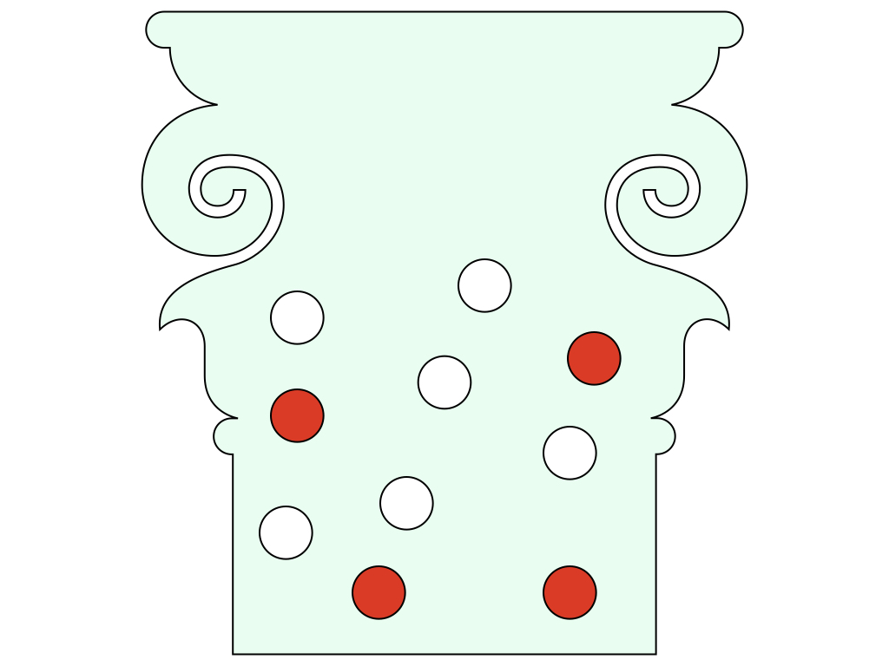

```{r setup, include=FALSE}
set.seed(100)
interval <- rexp(80, 3)
knitr::opts_chunk$set(fig.align = "center", prompt = TRUE, dpi = 196)
options(width = 63)
```

## 先週やったこと

- ポアソン過程
  - ポアソン分布
  - 指数分布
- **devEMF**

---

## 今日やること

- 奥村 5章
- 分割表の解析 (独立性の検定)

---

## 分割表の例

|          | 肺がんあり | 肺がんなし |
|----------|-----------:|-----------:|
| 喫煙あり |        231 |      23036 |
| 喫煙なし |         26 |      10813 |


喫煙が肺がんに影響しているといえますか？

---

## フィッシャーの正確検定（1/）

壺の中に赤玉4個，白玉6個  

```{r vase, echo=FALSE, out.width=500}

```


---

## フィッシャーの正確検定（2/）

ランダムに5個取り出す→ 赤3個，白2個

分割表を使って整理できる。

--

|            | 赤玉 | 白玉 | 合計 |
|------------|-----:|-----:|-----:|
| 取り出した |    3 |    2 |    5 |
| まだ壺の中 |    1 |    4 |    5 |
| 合計       |    4 |    6 |   10 |


「取り出し方に偏りはなかった？」を調べる。

---

## フィッシャーの正確検定（3/）


赤3個，白2個が出る確率は？

$$\begin{aligned}
\frac{
  {}_4 C_3 \times {}_6 C_2
}{
  {}_{10} C_5
}
=
`r choose(4, 3) * choose(6, 2) / choose(10, 5)`
\end{aligned}$$


```{r}
choose(4, 3) * choose(6, 2) / choose(10, 5)
```

---

## フィッシャーの正確検定（4/）

偏りなく取り出した場合に，観測されたデータか，それより珍しい現象が起こる確率を調べる。これが p値

取り出した数が5個, 赤玉の数が4個，白玉の数が6個という制約のもとであらゆる取り出し方を調べる。 

|            | 赤玉 | 白玉 | 合計 |
|------------|-----:|-----:|-----:|
| 取り出した |    k |  5-k |    5 |
| まだ壺の中 |  4-k |  k+1 |    5 |
| 合計       |    4 |    6 |   10 |


自由度が1つであることに注意！

---

## フィッシャーの正確検定（5/）

```{r, prompt=FALSE}
for (k in 4:0) {
  print(c(k, 4 - k, 5 - k, k+1))
}
```

```{r, prompt=FALSE}
p <- numeric(5)
for (k in 0:4) {
  p[k+1] <- choose(4, k) * choose(6, 5 - k) / choose(10, 5)
}
p
```


---

## フィッシャーの正確検定（6/）

観測された確率は `r p[2]` なので，これと同じかこれよりも低い確率を足すと p値が計算できる。

```{r, prompt=FALSE}
sum(p[p <= p[2]])
```

同じことを `fisher.test()` を使っても調べられる。

「フィッシャーの正確検定」という


---

## フィッシャーの正確検定（7/）

```{r}
fisher.test(matrix(c(3, 1, 2, 4), nrow = 2))
```


p値以外の部分の読み方は後ほど。


---

## `matrix()` について

以下のコードを実行して結果を比較してください。

```{r, prompt=FALSE, eval=FALSE}
matrix(c(1, 2, 3, 4, 5, 6))
matrix(c(1, 2, 3, 4, 5, 6), nrow = 2)
matrix(c(1, 2, 3, 4, 5, 6), ncol = 2)
matrix(c(1, 2, 3, 4, 5, 6), byrow = TRUE)
matrix(c(1, 2, 3, 4, 5, 6), nrow = 2, byrow = TRUE)
matrix(c(1, 2, 3, 4, 5, 6), ncol = 2, byrow = TRUE)
```

読みやすい書き方： 

```{r, prompt=FALSE}
matrix(c(1, 2, 3,
         4, 5, 6), ncol = 3, byrow = TRUE)
```

---

## 10個中4個取り出す

奥村 p. 77 のケース

```{r, prompt = FALSE}
fisher.test(
  matrix(c(3, 1,
           1, 5), ncol = 2, byrow = TRUE)
)
```

---

## 最初の肺がんの例

|          | 肺がんあり | 肺がんなし |
|----------|-----------:|-----------:|
| 喫煙あり |        231 |      23036 |
| 喫煙なし |         26 |      10813 |

```{r}
fisher.test(matrix(c(231, 26, 23036, 10813), nrow = 2))
```

---

## 大きい分割表 (1/)

|    | 内向 | 外向 |
|----|-----:|-----:|
| A  |  195 |  102 |
| B  |  123 |   82 |
| AB |   61 |   38 |
| O  |  144 |  107 |

データフレームを使うと便利。

```{r, prompt=FALSE}
df <- data.frame(
  内向 = c(195, 123, 61, 144),
  外向 = c(102, 82, 38, 107)
)
```

---

## 大きい分割表 (2/)

```{r, prompt=FALSE}
fisher.test(df)
```

血液型と内向性/外向性には関係がなさそう。


---

## カイ2乗検定 (1/)

.pull-left[
観測データ

|      | 賛成 | 反対 | 合計 |
|------|-----:|-----:|-----:|
| 男   |    3 |    2 |    5 |
| 女   |    1 |    4 |    5 |
| 合計 |    4 |    6 |   10 |

]

--

.pull-right[
男女差がない場合の理論値

|      | 賛成 | 反対 | 合計 |
|------|-----:|-----:|-----:|
| 男   |    2 |    3 |    5 |
| 女   |    2 |    3 |    5 |
| 合計 |    4 |    6 |   10 |
| 割合 |  0.4 |  0.6 |   10 |

]

合計の行から計算した割合で，男女の賛成・反対の理論値を求める。


---

## カイ2乗検定 (2/)

.pull-left[
観測データ

|      | 賛成 | 反対 | 合計 |
|------|-----:|-----:|-----:|
| 男   | $O_{11}$ | $O_{12}$ |    5 |
| 女   | $O_{21}$ | $O_{22}$ |    5 |
| 合計 |    4 |    6 |   10 |

]

.pull-right[
赤白が独立な場合の理論値

|      | 賛成 | 反対 | 合計 |
|------|-----:|-----:|-----:|
| 男   | $E_{11}$ | $E_{12}$ |    5 |
| 女   | $E_{21}$ | $E_{22}$ |    5 |
| 合計 |    4 |    6 |   10 |

]

各 $O_{ij}$ を平均 $E_{ij}$ のポアソン分布の実現値と考える。 

$$\frac{O_{ij} - E_{ij}}{\sqrt{E_{ij}}}\sim \mathcal{N}(0,1)$$

---

## カイ2乗検定 (3/)

近似的に

$$\frac{O_{ij} - E_{ij}}{\sqrt{E_{ij}}}\sim \mathcal{N}(0,1)$$

なので，

$$\sum \frac{(O_{ij} - E_{ij})^2}{E_{ij}} \sim \chi^2_{1}$$

自由度は1 （ $2\times2$ 分割表に制約が3つあるから）

---

## カイ2乗検定 (4/)

```{r, prompt=FALSE}
(observed <- matrix(c(3, 1, 2, 4), nrow = 2))
```

```{r, prompt=FALSE}
(prop <- colSums(observed) / sum(observed))
(estimated <- outer(rowSums(observed), prop))
```

---

## カイ2乗検定 (4'/)

$x \in \mathbb{R}^m$, $y \in \mathbb{R}^n$ に対して

$$\mathrm{outer}(x, y) = xy^\top \in \mathbb{R}^{m \times n}$$


```{r prompt=FALSE}
outer(c(1, 2), c(0.2, 0.3, 0.4))
```

---

## カイ2乗検定 (5/)

```{r prompt=FALSE}
chi2 <- sum((observed - estimated) ^ 2 / estimated)
chi2
```

この統計量を使って p値を計算する。

```{r, prompt=FALSE}
1 - pchisq(chi2, df = 1)
```

---

## カイ2乗検定 (6/)

`chisq.test()` を使っても計算できる。

```{r, prompt=FALSE}
chisq.test(observed, correct = FALSE)
```

---


## 連続性補正

離散分布に関する確率を連続分布で近似して計算するときに「連続性補正」というのを行う場合がある。さきほどの統計量で言えば

$$\sum \frac{(O_{ij} - E_{ij})^2}{E_{ij}}
\longrightarrow 
\sum \frac{(|O_{ij} - E_{ij}| - 0.5)^2}{E_{ij}}$$

とする。 `chisq.test()` はデフォルトでは連続性補正（Yates's continuity correction）を行う。`correct = FALSE` を外して再度実行してみよう。

---

## 練習問題

次の分割表に対して独立性の検定を実施せよ。

|    | 内向 | 外向 |
|----|-----:|-----:|
| A  |  195 |  102 |
| B  |  123 |   82 |
| AB |   61 |   38 |
| O  |  144 |  107 |


1. 検定統計量を自分で計算する方法（ヒント：行が増えた分だけ自由度も増える）
1. `chisq.test()` を用いた方法, 連続性補正ありとなし
1. `fisher.test()` を用いた方法

---

## オッズ

ある事象が起こる確率を $p$ とするとき，オッズを次のように定義する。

$$\mathrm{オッズ} = \frac{p}{1 - p}$$

2つ群を考える。それぞれの群において，ある事象がおこる確率を $p, q$ とする。

$$\mathrm{相対危険度\ RR} = \frac{p}{q},\qquad 
\mathrm{オッズ比\ OR} = \frac{p/(1-p)}{q/(1 - q)}$$

---

## オッズ比を用いた独立性の検定 (1/)

|            | Disease | Nondisease |
|------------|---------|------------|
| Exposed    | $a$     | $b$        |
| Nonexposed | $c$     | $d$        |

- Exposed = 暴露群
- Nonexposed = 非暴露群（p. 81 の下から3行目はタイポ）


$$
\mathrm{RR} = \frac{a/(a+b)}{c/(c+d)},
\quad
\mathrm{OR} = \frac{a / b}{c / d}
$$

2群に差がなければ $\mathrm{RR} = \mathrm{OR} = 1$ となる（帰無仮説）

---

## オッズ比を用いた検定 (2/)

オッズ比の対数

$$
\log \mathrm{OR} = \log a - \log b - \log c + \log d
$$

は正規分布で近似できて，分散は $1/a + 1/b + 1/c + 1/d$ である。

これさえ知っていれば信頼区間を計算できる。

---

## オッズ比を用いた検定 (3/)

```{r, prompt=FALSE}
x <- matrix(c(231, 26, 23036, 10813), nrow = 2)
x

LOR <- log(x[1, 1] * x[2, 2] / x[1, 2] / x[2, 1])
V <- sum(1 / x)
exp(LOR + sqrt(V) * qnorm(c(0.025, 0.975)))
```

信頼区間がゼロを含んでいなければ有意差があると考える。  
`fisher.test()` で出力される数字との違いは p. 79 を参照

---

## マクネマー検定 (1/)

教育や実験の前後で起こった変化を検定する。

つまり，以下のような表を作って $b$ と $c$ について検定を行う。

|                  | ポストテスト合格 | ポストテスト不合格 |
|------------------|------------------|--------------------|
| プリテスト合格   | $a$              | $b$                |
| プリテスト不合格 | $c$              | $d$                |


$$
M = \frac{(|b - c| - 1)^2}{b+c}
$$

自由度1のカイ2乗分布を用いる。 $-1$ は連続性補正

---

```{r}
mcnemar.test(matrix(c(6, 8, 1, 5), ncol = 2))
```


```{r}
binom.test(1, 1 + 8)  # 2項検定を使ってもよい。
```

---

## 練習してみよう

```r
devtools::install_github("opueco/R4FunDrill")
R4FunDrill::start("Day07")
```
チュートリアルがはじまるよ。