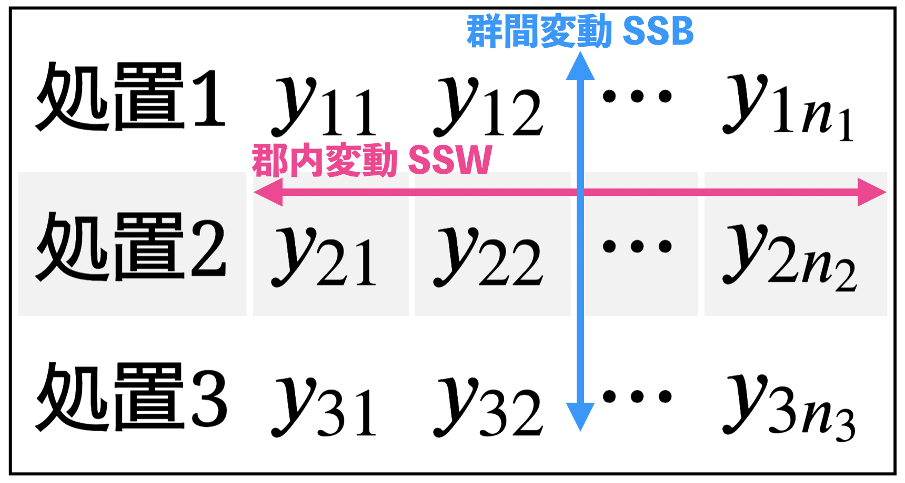

```{r setup, include=FALSE}
set.seed(100)
interval <- rexp(80, 3)
knitr::opts_chunk$set(fig.align = "center", prompt = TRUE, dpi = 196)
options(width = 63)
```

## 先週やったこと

- 分割表の解析 (独立性の検定)

---

## 今日やること

- 奥村 6章
- 2標本の差の t検定
  - 対標本
  - 対応のない2標本（ウェルチのt検定）
- 一元配置分散分析

---

## 対応のあるt検定 (1/)

神永・木下（2019）『Rで学ぶ確率統計学　一変量統計編』 pp. 134-5 の例

短期記憶に関する実験。飲酒によって想起能力は悪くなるか？

|        |  A |  B |  C |  D |  E |
|--------|---:|---:|---:|---:|---:|
| 飲酒前 | 18 | 12 | 16 | 15 | 20 |
| 飲酒後 | 15 | 13 | 14 | 11 | 17 |

```{r}
before <- c(18, 12, 16, 15, 20)
after <- c(15, 13, 14, 11, 17)
```

---

## 対応のあるt検定 (2/)

差を取って，差の平均が 0 より大きいかを検定する。

|        |  A |  B |  C |  D |  E |
|--------|---:|---:|---:|---:|---:|
| 差     | 3  | -1 | 2  | 4  | 3  |

```{r}
t.test(before - after, alternative = "greater")
```

---

## 対応のあるt検定 (3/)

`t.test()` は2標本を取ることができる。対標本の場合は `paired = TRUE` とする。


```{r}
t.test(before, after, paired = TRUE, alternative = "greater")
```


---

## 例題

統計WEB <https://bellcurve.jp/statistics/course/9453.html>

血圧を下げる薬のテストを行います。被験者5人に対して薬の投与前と投与後の血圧を測定したところ、次の表のような結果が得られました。この結果から、薬の投与によって血圧は下がったと言えるでしょうか。


| ID           |   1 |   2 |   3 |   4 |   5 |
|--------------|----:|----:|----:|----:|----:|
| 投与前の血圧 | 180 | 130 | 165 | 155 | 140 |
| 投与後の血圧 | 150 | 135 | 145 | 150 | 140 |


---

## 問題

対応のあるt検定はどのような問題に対して適用できるだろうか？検定の実施例を3つ考えなさい。

---

## 対応のない2標本の平均の差 (1/)

東大出版『統計学入門』p. 231 の例

20匹のラットを10匹ずつ2群に分け，一方にはふつうの食餌を与え，他方には血中の赤血球数を減らすと考えられている薬を混入した食餌を与えた場合の，血液 $1\mathrm{mm}^3$ 中の赤血球数である。投薬群と対照群で差があるといえるか？

.empty-header[

||
|--------|------|------|------|------|------|------|------|------|------|------|
| 投薬群 | 7.97 | 7.66 | 7.59 | 8.44 | 8.05 | 8.08 | 8.35 | 7.77 | 7.98 | 8.15 |
| 対照群 | 8.06 | 8.27 | 8.45 | 8.05 | 8.51 | 8.14 | 8.09 | 8.15 | 8.16 | 8.42 |
]

---

## 対応のない2標本の平均の差 (2/)

次のことを知りたい：

確率変数 $X$ から引き出した $m$ 個の値 $X_1, X_2, \dots, X_m$ と
確率変数 $Y$ から引き出した $n$ 個の値 $Y_1, Y_2, \dots, Y_n$ がある。
$X$ と $Y$ の母平均は等しいか？

$$\bar{X} - \bar{Y}$$

の分布がわかるとよさそう。

---

## 対応のない2標本の平均の差 (3/)

次の統計量を調べるとよい。


$$t=\frac{\bar{X}-\bar{Y}}{\sqrt{\frac{s_{X}^{2}}{m}+\frac{s_{Y}^{2}}{n}}}$$

これは近似的に t分布に従う。自由度は

$$\nu=\frac{\left(\frac{s_{X}^{2}}{m}+\frac{s_{Y}^{2}}{n}\right)^{2}}{\frac{1}{m-1}\left(\frac{s_{X}^{2}}{m}\right)^{2}+\frac{1}{n-1}\left(\frac{s_{Y}^{2}}{n}\right)^{2}}$$

---

## 対応のない2標本の平均の差 (4/)

実験してみよう。

```{r, prompt = FALSE, out.height=300}
tgen <- function(m, n){
  X <- rnorm(m, mean = 0)
  Y <- rnorm(n, mean = 0)
  (mean(X) - mean(Y)) / sqrt(var(X) / m + var(Y) / n)
}

nu <- function(x, y){
  sxm <- var(x) / length(x)
  syn <- var(y) / length(y)
  (sxm + syn) ^ 2 / 
    ((sxm)^2 / (length(x)-1) + (syn)^2 / (length(y)-1))
}
```

---


## 対応のない2標本の平均の差 (5/)

```{r welch,  prompt=FALSE, out.height=300}
x <- rnorm(20, mean = 0)
y <- rnorm(30, mean = 0)
df <- nu(x, y)

t <- replicate(2000, tgen(m = 20, n = 30))
hist(t, breaks = 30, col = "gray", freq = FALSE)
curve(dt(x, df = df), add = TRUE)
```

---


## 対応のない2標本の平均の差 (6/)

上で定義した $t$ を使って検定する方法を，ウェルチの t検定という。

**注意**

等分散性を検定して，棄却された場合にのみウェルチ検定をするという手続きを教科書に書いている場合がある。しかし，そういう場合分けは問題があるらしい。いつでもいきなりウェルチ検定をする。

R の `t.test()` には `var.equal` というオプションパラメータがあるが，通常は使う必要がない。

---

## 対応のない2標本の平均の差 (7/)

先程の例

```{r, prompt=FALSE}
treatment <- c(7.97, 7.66, 7.59, 8.44, 8.05, 
               8.08, 8.35, 7.77, 7.98, 8.15)
control <- c(8.06, 8.27, 8.45, 8.05, 8.51, 
             8.14, 8.09, 8.15, 8.16, 8.42)

m <- length(treatment); n <- length(control)
welch_t <- (mean(treatment) - mean(control)) / 
            sqrt(var(treatment) / m + var(control) / n)
welch_t

nu(treatment, control)
```


---

## 対応のない2標本の平均の差 (8/)

片側 p値（`mean(treatment) < mean(control)` か？）

```{r, prompt=FALSE}
pt(welch_t, df = nu(treatment, control))
```


```{r, prompt=FALSE}
t.test(treatment, control, alternative = "less")
```

---

## 分散分析

- 3クラスの学年でテストを行った。クラス内での点数のばらつきに対して，
  クラス間のばらつきのほうが大きいと言えるか？
  （クラスによって成績の違いがあると言ってよいか？）
- 患者をランダムに3群に分けて3種類の薬を与えたときのデータで，薬の効果は
  患者間のばらつきより大きいといえるか？（薬は効いているか？）

---

## 一元配置分散分析 (1/)

.empty-header[

|       |          |          |          |            |
|-------|---------:|---------:|---------:|-----------:|
| 処置1 | $y_{11}$ | $y_{12}$ | $\cdots$ | $y_{1n_1}$ |
| 処置2 | $y_{21}$ | $y_{22}$ | $\cdots$ | $y_{2n_2}$ |
| 処置3 | $y_{31}$ | $y_{32}$ | $\cdots$ | $y_{3n_3}$ |

]

- 同じ処置を受けたグループ内の変動（分散）を除去し，
- 違う処置を受けたグループ間の変動（分散）を測る
- これによって，処置の違いが引き起こす変化を読み取る事ができる。

---

## 一元配置分散分析 (2/)

モデル

$$y_{ij} = \mu + \beta_{i} + \varepsilon_{ij}$$

- $i =$ グループのラベル ( $i=1,\dots,k$)
- $j =$ グループ内の個体のラベル
- $\mu=$ 全体の平均, $n_i$ はグループの個数， $N$ は総数
- $\beta_i=$ グループの平均と全体の平均の乖離 $\sum_i n_i \beta_i = 0$
- $\varepsilon_{ij}$ は独立同一な正規分布で平均ゼロ

---

## 一元配置分散分析 (3/)

このモデルは

$$x_s = \begin{cases}
  1 & \text{if} & s = i\\
  0 & \text{if} & s \neq i \end{cases}$$


として，線形回帰モデル

$$y_{ij} = \mu + \beta_1 x_1 + \cdots + \beta_k x_k + \varepsilon_{ij}$$

と解釈できる。

---

## 一元配置分散分析 (4/)

帰無仮説 $H_0$

$$\beta_1 = \cdots = \beta_k=0$$

対立仮説 $H_1$

$$\text{ある } i \text{ について}\quad \beta_i \neq 0$$

---

## 一元配置分散分析 (5/)

詳しくは線形回帰モデルの分析を扱う際に述べますが， 

- $R_0^2 =$ $H_0$ を仮定しないときの残差平方和（回帰誤差）
- $R_1^2 =$ $H_0$ を仮定したときの残差平方和

を比較する。仮説検定にはF検定を用いる。


$$\text{(郡内変動)}\quad \mathrm{SSW} = R_0^2
\qquad
\text{(郡間変動)}\quad \mathrm{SSB} = R_1^2 - R_0^2$$

$$\frac{\mathrm{SSB}/(k-1)}{\mathrm{SSW}/(N-k)}
\sim F(k-1, N-k)$$

---

## 一元配置分散分析 (6/)


```{r vase, echo=FALSE, out.width=500}

```

---

## 一元配置分散分析 (7/)

全体の平均

$$\mu \approx \frac{1}{N} \sum_{i,j} y_{ij} = \bar{y}_{\bullet \bullet}$$
グループの平均

$$\mu + \beta_i \approx \frac{1}{n_j} \sum_{j=1}^{n_j} y_{ij} = \bar{y}_{i\bullet}$$

---

## 一元配置分散分析 (8/)

$$\begin{aligned}
\mathrm{SSW} 
=
R_0^2
=
\sum_{i,j} (y_{ij} - \bar{y}_{i\bullet})^2
\end{aligned}$$

$$\begin{aligned}
R_1^2 
=
\sum_{ij} (y_{ij} - \bar{y}_{\bullet\bullet})^2
\end{aligned}$$

さらに

$$\begin{aligned}
\mathrm{SSB}
=
R_1^2 - R_0^2
=
\sum_i (\bar{y}_{i\bullet} - \bar{y}_{\bullet\bullet})^2
\end{aligned}$$

であることが分かる。手計算をするときはこの公式が便利。

---

## 一元配置分散分析 (9/)

F値は

$$F = 
\frac{
\mathrm{SSB} / (k-1)
}{
\mathrm{SSW} / (N-k)
}
=
\frac{
\sum_i (\bar{y}_{i\bullet} - \bar{y}_{\bullet\bullet})^2 / (k-1)
}{
\sum_{i,j} (y_{ij} - \bar{y}_{i\bullet})^2 / (N-k)
}
.$$

計算してみよう。以下は久保川・国友（p. 255）, Draper and Smith (1998) から。

```{r, prompt=FALSE}
gr1 <- c(242, 245, 244, 248, 247, 248, 242, 244, 246, 242)
gr2 <- c(248, 246, 245, 247, 248, 250, 247, 246, 243, 244)
gr3 <- c(246, 248, 250, 252, 248, 250, 246, 248, 245, 250)
```

---

## 一元配置分散分析 (10/)

```{r, prompt=FALSE}
Y <- c(gr1, gr2, gr3)
grp <- factor(rep(c("gr1", "gr2", "gr3"), 
                    c(length(gr1), length(gr2), length(gr3))))
```

$y_{ij} - \bar{y}_{i\bullet} =$

```{r, prompt=FALSE}
Y - ave(Y, grp)
```

```{r, prompt=FALSE}
SSW <- sum((Y - ave(Y, grp)) ^ 2)
```

---

## 一元配置分散分析 (11/)

$y_{ij} - \bar{y}_{\bullet\bullet} =$

```{r, prompt=FALSE}
Y - ave(Y)
```

```{r, prompt=FALSE}
SSB <- sum((Y - ave(Y)) ^ 2) - SSW
```

---

## 一元配置分散分析 (12/)

```{r, prompt=FALSE}
N <- length(dta)
k <- length(levels(grp))
F <- (SSB / (k - 1)) / (SSW / (N - k))
F
```

片側 p値は

```{r, prompt=FALSE}
1 - pf(F, df1 = k - 1, df2 = N - k)
```

「群間で平均に差がない」という帰無仮説は棄却される。

---

## 一元配置分散分析 (13/)

自分で計算する方法がわかったところで，Rの便利な関数を使ってみる。
分散分析が線形回帰モデルと解釈できたことを思い出そう。
以下のコマンドで「分散分析表」を出力できる

```{r, prompt=FALSE}
anova(lm(Y ~ grp))
```

`lm` は Linear Model, `ANOVA` は Analysis of Variance の略。

---

## 一元配置分散分析 (14/)

次のコマンドでも同様の分析ができる。

```{r, prompt=FALSE}
oneway.test(Y ~ grp, var.equal=TRUE)
```

`var.equal=TRUE` を外すと，ウェルチのt検定と同じく等分散を仮定しない検定ができる。

---

## 練習してみよう

```r
devtools::install_github("opueco/R4FunDrill")
R4FunDrill::start("Day08")
```
チュートリアルがはじまるよ。