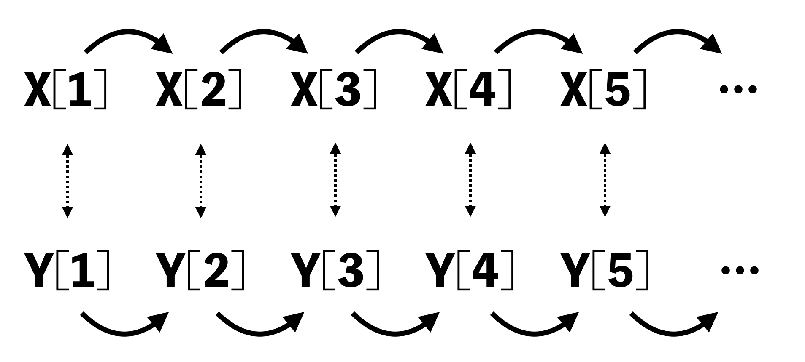

```{r setup, include=FALSE}
set.seed(100)
knitr::opts_chunk$set(fig.align = "center", prompt = TRUE, dpi = 196,
                      out.height = 500)
options(width = 63)
```

## 先週やったこと

- 奥村 6章
- 2標本の差の t検定
  - 対標本
  - 対応のない2標本（ウェルチのt検定）
- 一元配置分散分析

先週のドリルでは二元配置分散分析について簡単に紹介しています。

---

## 今日やること

- 相関

---

## クイズ: 正の相関？負の相関？

```{r cor-quiz1, echo=FALSE}
a <- rnorm(40)
b <- rnorm(40)
c <- rnorm(40)
x <- a + 3 * c
y <- b + 3 * c
plot(x, y, pch = 16)
```

---

## クイズ: 正の相関？負の相関？

```{r cor-quiz2, echo=FALSE}
x <- a + c
y <- b - 3 * c
plot(x, y, pch = 16)
```

---

## クイズ: 相関が強いのはどちら？

```{r cor-quiz3, echo=FALSE, fig.asp=0.7}
opar <- par(mfrow = c(1, 2))
x <- rnorm(40)
y1 <- 0.8 * x + 0.4 * rnorm(40)
y2 <- 0.8 * x + 0.8 * rnorm(40)
plot(x, y1, pch = 16)
plot(x, y2, pch = 16)
par(opar)
```

---

## クイズ: 相関が強いのはどちら？

```{r cor-quiz4, echo=FALSE, fig.asp=0.6}
opar <- par(mfrow = c(1, 2))
x <- seq(0, 1, length.out = 40)
e <- 0.1 * rnorm(40)
y3 <- 2 * x + 1.5 * e
y4 <- x + 0.7 * e
plot(x, y3, pch = 16)
plot(x, y4, pch = 16, ylim = c(0, 2))
par(opar)
```


---

## 共分散

2つの確率変数 $X$, $Y$ の **共分散** (covariance) を次のように定義

$$\begin{aligned}
\mathrm{Cov}(X,Y) 
&= \mathbb{E}[(X - \mathbb{E}[X])(Y - \mathbb{E}[Y])]\\
&= \mathbb{E}[XY] - \mathbb{E}[X] \mathbb{E}[Y]
\end{aligned}$$

標本に対する定義は

$$\begin{aligned}
\mathrm{Cov}(\{X_i\}_{i=1}^n,\{Y_i\}_{i=1}^n) 
&= \frac{1}{n-1} \sum_{i=1}^n (X_i - \bar{X})(Y_i - \bar{Y})\\
&= \frac{1}{n-1} \sum_{i=1}^n X_iY_i - \bar{X} \bar{Y}
\end{aligned}$$

---

## Rによる共分散の計算


```{r, prompt=FALSE}
x <- 1:5
y <- c(3, 4, 5, 2, 1)
sum((x - mean(x)) * (y - mean(y))) / (length(x) - 1)
```

--

```{r, prompt=FALSE}
cov(x, y)
```

---

## 共分散の意味

$X$ が平均より大きいときに $Y$ も平均より大きい, $Y$ が平均より小さいときに $Y$ も平均より小さい傾向があるときには，共分散は正になる。

逆に, $X$ が平均より大きいときに $Y$ も平均より小さくなる傾向があれば 共分散は負になる。


---

## 相関係数 (1/)

共分散は $X$, $Y$ が同じ方向に動くか，反対方向に動くかを教えてくれる。
しかし, $X$, $Y$ の値の大きさによって共分散も変化してしまうので，2変数の動く方向の尺度としては使いづらい。

--


そこで，大きさを調整してやることを考える。要するに標準化する。

$$\frac{X - \mathbb{E}[X]}{\sigma_X},
\qquad \frac{Y - \mathbb{E}[Y]}{\sigma_Y}$$

標準化された変数の共分散を求めたものが **相関係数** (correlation coefficient)

---

## 相関係数 (2/)

$$\begin{aligned}
\mathrm{Cor}(X, Y)
&=\mathrm{Cov}
\left(
\frac{X - \mathbb{E}[X]}{\sigma_X}, 
\frac{Y - \mathbb{E}[Y]}{\sigma_Y}
\right)\\
&=
\frac{\mathrm{Cov}(X,Y)}{\sigma_X \sigma_Y}\\
&=
\rho
\end{aligned}$$

--

コーシー・シュワルツの不等式から次の2つのことが分かる。

- $-1 \le \rho \le 1$
- 完全な線形関係 $X = tY$, $t\neq0$, があるとき，またそのときに限り
  $|\rho| = 1$

---

## 相関係数 (3/)

標本に対する相関係数の定義は

$$\begin{aligned}
r = \frac{1}{n-1} \sum_{i=1}^n \frac{X_i - \bar{X}}{s_X} \frac{Y_i - \bar{Y}}{s_Y}
\end{aligned}$$
---

## Rによる相関係数の計算

```{r, prompt=FALSE}
cov(x, y) / sd(x) / sd(y)
```

あるいは

```{r, prompt=FALSE}
cor(x, y)
```

---

## 相関係数に関する注意 (1/)

- $X$, $Y$ が独立だと $X$, $Y$ は無相関（相関係数がゼロ）
  - ただし，無相関だからといって独立とは限らない


--

.pull-left[
```{r, prompt=FALSE}
x <- -4:4
y <- x ^ 2
cor(x, y)
```

独立と判断する前に散布図を書く。
]

--

.pull-right[
```{r quadratic, echo=FALSE, out.height=300}
plot(x, y, pch=16,cex=1.5)
```
]

---

## 相関係数に関する注意 (2/)

- 散布図が水平，垂直に並んでいたら相関係数はゼロに近い

```{r scatter-hv, prompt=FALSE, out.height=300}
x <- runif(100)
y <- 0.5 + 0.2 * runif(100)
plot(x, y, pch = 16, main=paste("cor =", cor(x,y)), ylim=c(0,1))
```

---

## 相関係数に関する注意 (3/)

- 「傾き」と相関係数の大きさは関係がない。あくまでも直線に近いかどうかが大事

```{r scatter-lin, prompt=FALSE, out.height=300}
y <- 0.05 * x
plot(x, y, pch = 16, main=paste("cor =", cor(x,y)), ylim=c(0,1))
```

---

## 相関係数の検定 (1/)

$X$, $Y$ が独立で同一な正規分布に従うならば, それぞれ $n$個ずつ抽出した標本 $\{X_i\}_{i=1}^n$, $\{Y_i\}_{i=1}^n$ から計算できる次の量

$$t = \frac{r\sqrt{n - 2}}{\sqrt{1 - r^2}}$$

は自由度 $n-2$ の t 分布に従う。


**注意**

正規分布なら「無相関⇒独立」が言える。データの数が大きければ正規分布でなくても上の事実が近似的に成り立つ。

---

## 相関係数の検定 (2/)

例のごとく実験する。

```{r texperiment1, eval=FALSE, prompt=FALSE}
n <- 15
t <- replicate(1000, {
    x <- rnorm(n); y <- rnorm(n)
    cor(x, y) * sqrt(n-2) / sqrt(1 - cor(x, y)^2)
  })
hist(t, breaks = 30, freq = FALSE)
curve(dt(x, df = n - 2), add = TRUE)
```


問題: `rnorm` を別の分布に変えて実験してみよう。

---

## 相関係数の検定 (3/)

```{r ref.label='texperiment1', echo=FALSE}
```

---

## 相関係数の検定 (4/)

```{r, prompt=FALSE}
n <- 40; a <- rnorm(n); b <- rnorm(n); c <- rnorm(n)
x <- a + c
y <- b + c
cor.test(x, y)
```

---

## 相関係数の検定 (5/)

```{r, prompt=FALSE}
(t <- cor(x, y) * sqrt(n-2) / sqrt(1 - cor(x, y)^2))  # t
2 * pt(-abs(t), df = n - 2)                           # p-value
(ci <- t + qt(c(0.025, 0.975), df = n - 2))      # 95% CI for t
ci / sqrt(n - 2 + ci ^ 2)
```


---

## 相関係数の検定 (6/)

参考：n が4以上であれば，CIは Fisher のZ変換というものを使う。

```{r}
r <- cor(x, y)
tanh(atanh(r) + qnorm(c(0.025, 0.975)) / sqrt(n - 3))
```

- ヘルプ `help(cor.test)` および
- [Wikipedia: Pearson Correlation Coefficient](https://en.wikipedia.org/wiki/Pearson_correlation_coefficient#Using_the_Fisher_transformation)

---

## 外れ値 (1/)

上で定義した $r$ は **ピアソンの積率相関係数** という。

ピアソンの積率相関係数は **外れ値に弱い** という弱点がある。
実験してみよう。

```{r}
x <- rnorm(50)
y1 <- x + 0.5 * runif(50)
cor(x, y1)
```

```{r}
y2 <- y1; y2[5] <- y1[5] + 15
cor(x, y2)
```

---

## 外れ値 (2/)

```{r outlier, out.height=400}
plot(x, y2)
points(x, y1, pch=4)
```

---

## 外れ値に強い相関係数 (1/)

**スピアマンの順位相関係数** $\rho=$ データの順位について積率相関係数を計算する。

```{r, eval=FALSE}
cor(rank(x), rank(y1))
cor(rank(x), rank(y2))
```

`cor()` に `method = "spearman"` を渡してもよい。

```{r}
cor(x, y1, method = "spearman")
cor(x, y2, method = "spearman")
```

---

## 外れ値に強い相関係数 (2/)

**ケンドールの順位相関係数** $\tau =$ ランダムに2組の観測値を選んだとき $(x_i - x_j)(y_i - y_j) > 0$ になる確率。

```{r}
cor(x, y1, method = "kendall")
cor(x, y2, method = "kendall")
```


---

## 外れ値に強い相関係数 (3/)

```{r, prompt=FALSE}
## p. 118 の手順
tau <- function(x, y){
  S <- 0; mx <- 0; my <- 0
  for (i in seq(1, length(x) - 1)){
    for (j in seq(i + 1, length(x))){
      if (isTRUE(all.equal(x[i], x[j])) || 
          isTRUE(all.equal(y[i], y[j]))){
        next()
      } else {
        S <- S + sign((x[i] - x[j]) * (y[i] - y[j]))
        mx <- mx + 1; my <- my + 1
      }
    }
  }
  S / sqrt(mx * my)
}

tau(x, y1)
```


---

## 外れ値に強い相関係数 (4/)

Pearson　の $r$

```{r}
cor.test(x, y2)
```

---

## 外れ値に強い相関係数 (5/)

Spearman の $\rho$ (検定の理論は省略)

```{r}
cor.test(x, y2, method = "spearman")
```

---

## 外れ値に強い相関係数 (6/)

Kendall の $\tau$ (検定の理論は省略)

```{r}
cor.test(x, y2, method = "kendall")
```

---

## 日教組組織率と学力の関係 (1/)

§8.2 と §8.5 では，「日教組が強いところは学力が低い」という失言と，新聞社が行った「統計分析」について述べてある。

- 朝日新聞の検証（負の相関はないという説）
- 産経新聞の検証（負の相関があるという説）

いずれも自説に都合のよいようにデータを加工していて，信頼性できないということが説明してある。当該セクションを一読することをおすすめする。

---

## 日教組組織率と学力の関係 (2/)

```{r}
df <- read.csv("https://git.io/fjwcr", fileEncoding = "UTF-8")
names(df)
```


```{r, eval=FALSE}
View(df)
```

---

## 日教組組織率と学力の関係 (2/)

p. 122 には，有効投票数で割って検定し直せと（行間に）書いているので，やってみる。

```{r, prompt=FALSE}
df$nikkyoso <- (df$H16参院選那谷屋正義 / df$H16有効投票数 + 
                       df$H19参院選神本みえ子 / df$H19有効投票数)
cor.test(df$総合点, df$nikkyoso)
```


---

## 日教組組織率と学力の関係 (3/)

```{r, prompt=FALSE}
cor.test(df$総合点, df$nikkyoso, method = "pearson")
```

相関があるとは言えなさそうである。

---

## 自己相関 (1/)


直接関係していない変数同士が第三の変数「交絡因子」を通じて相関してしまうことがある。
つまり，相関は因果関係を意味しない。

時系列データの相関係数を計算すると，高い相関が出やすい。
時系列データは共通の「時間」という要因と相関しているから。

---

## 自己相関 (2/)

独立な2つの時系列データ（あるいは一般に自己相関の強い変数）に現れる相関を **疑似相関** (spurious correlation) と呼ぶ。

```{r spurious, out.height=350, echo=FALSE}

```


---

## 自己相関 (3/)

```{r, prompt=FALSE}
cor(cumsum(rnorm(200)), cumsum(rnorm(200)))
```


---

## 練習してみよう

```r
devtools::install_github("opueco/R4FunDrill")
R4FunDrill::start("Day09")
```
チュートリアルがはじまるよ。